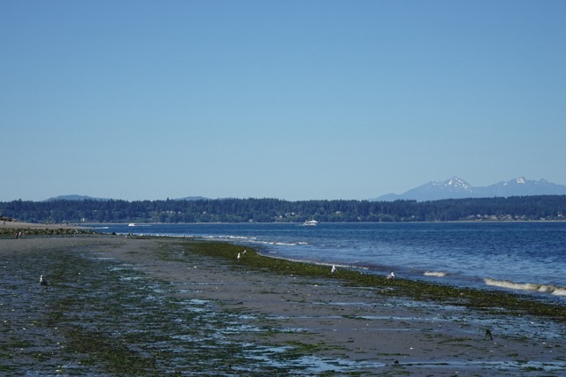
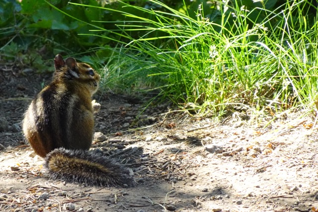
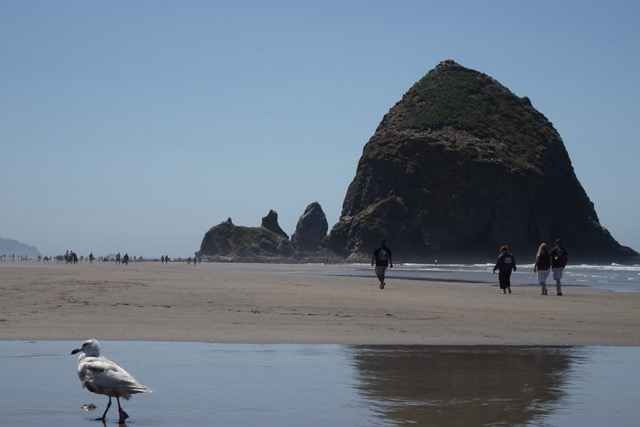
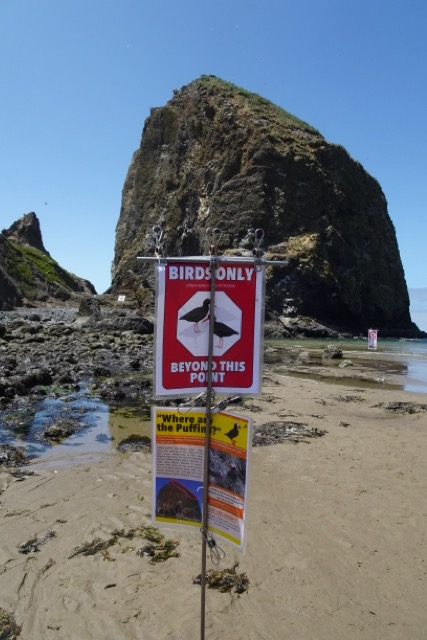
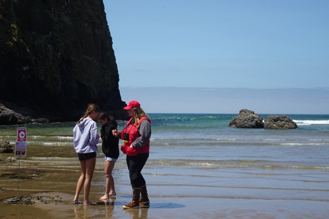
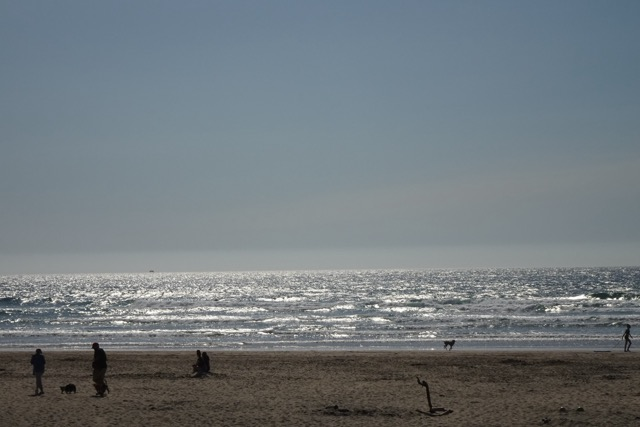
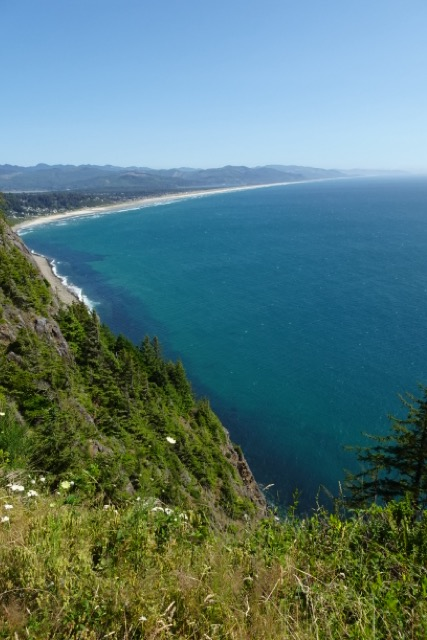
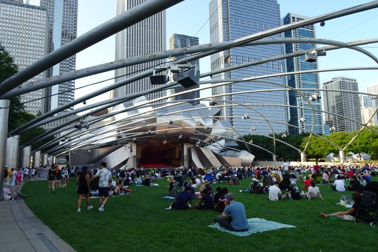

## 游记

### 出发 JULY 5th 

在飞向西雅图的飞机上写日记。

巴尔的摩闷热的空气让我一身臭汗，简直堪比37度细胞培养箱。——此地不可久留。关于未来10天的旅行，我什么计划都没做。放松吧，去干那些一直想干的事情——开车、听音乐、看海。我的天，每天再喝点酒、钓个情人的话，简直就像是去西藏寻找自我的文艺青年了。总之，没什么期待，“只要不是巴尔的摩，哪里都行”！

### 西雅图D1 JULY 6th

{group='grp'}

赶海太好玩了！我们在潮间带的岩缝里发现了不少橙色的大海参。用卫生巾的纸戳了它们，立刻就缩回去了，不知道是在攻击还是在防御……还见到了灰翅鸥（翼展132-137cm）和大蓝鹭。居然还有乌鸦。鸟儿也赶海，估计有不少吃的吧！海鸥很好玩的，它们居然吃海星，也吃螃蟹，身子大得吓人，但我和阿闲老师为了一探究竟，还是勇敢地从海鸥群中穿行而过。感觉一只就能打两只巴尔的摩海鸥（笑鸥，翼展98-119cm）。

今天也是MeLennon日，晚上和阿闲老师看了Two of Us，讲的是70年代约翰和保罗在纽约私会的故事，挺好看的电影。晚上一边喝酒一边疯狂地谈论自家CP，真的挺超现实的。阿闲老师锐评我这本日记的本质就是1/3的RIDE加上1/3的the Smiths和1/3的现实内容，其实不是这样的，RIDE已经深深地渗入了我的现实中，因为这次美西巡游其实有参考RIDE的美巡路线（。不然我为什么放着其他地方不去非得去波特兰，因为Interplay里有Portland Rocks啊！散步的时候还路过了Neptune，就是Lana del Rey在Ride（此Ride非彼RIDE）mv里表演的地方。

西雅图的公共交通好到让我很感动，地铁干净又宽敞。因为没有闸机所以地铁*事实上*是可以一直逃票的……

### 西雅图D2 JULY 7th

{group='grp'}

今天和阿闲老师的朋友一起度过了疯狂的户外一天。在爬了一个小时山以后于山崖之上遇见了花栗鼠！还在湖里看到两对蓝色的蜉蝣交配。虽然重点应该是爬上山巅站在世界之巅俯瞰大地之渺小。感觉自己的运动能力变强了！

### 西雅图D3 JULY 8th

周一主要就是城里各处逛了逛，阿闲老师说我是在一年里难得的晴朗季节来拜访了，还挺好的。城里时不时过一个转角就能看到雪山和海，就是坡很多。今天去了很多音乐爱好者的圣地巡礼场所：

1. Kurt Cobain故居：冷冷清清的，长椅上摆满了花和烟，还有一张库洛米贴纸。正好在手机壳里塞了张拨片就放那儿了。

2. MoPop：还挺好玩，喜欢三楼的Sound Lab。

3. KEXP：坐落在一个类似于大公园的地方，氛围很酷。脖子老师叫我去催RIDE的session哈哈。KEXP还发一些无料，我去尴尬地对着Staff夸了一通彩虹屁。

### 波特兰D1 JULY 9th

西雅图到波特兰的Amtrak一股尿味，人很少，但不巧遇上了一家子带仨小孩，吵得人脑壳疼。但开出西雅图的时候可以看到雪山，开进波特兰的时候可以看到横跨Willamette River的大桥上的美景，也算是安慰了。波特兰的公共交通还ok，河那么漂亮，但似乎没有沿河的公园可以让人在晚上散步。

住了青旅KEX Portland，装修非常漂亮，把包带抓在手里塞进枕头下面，睡得也挺香的。卫生间的设置很好玩，锁上门就能一人独享一个巨大的、公共浴室大小的浴室。房间里没有桌子，不过也没事，就是把平常在房间里伏案的时间搬到外面来了而已。KEX的吧台很不错，喝到了一杯非常好喝的血腥玛丽。音响播放的是Patti Smith的Redondo Beach，唱的是一个女孩和同伴吵了一架以后赌气出门，结果淹死在海里的故事——我没有伙伴，所以危险降到了最低！真是先见之明。

波特兰城里热得和美东有的一拼，遂进行了对体力比较友好的活动。Powell's Books很好逛，买了三本书，一本观鸟的Field Guide，一本艾略特的荒原，一本布劳提根的诗集，都是小薄册，照顾我的登机箱。观鸟真是妙趣无穷啊。明天继续。

### 波特兰D2 JULY 10th

::: photo-row

{group='grp'}

{group='grp'}

{group='grp'}
:::

Cannon Beach真是无比美丽。在银白的沙滩上倾听太平洋的呼唤实在太棒了，我简直没法想象一个更棒的场景！不由自主地脱掉鞋袜在海滩上来回走了三小时，一边踢水玩一边大唱《外婆的澎湖湾》，“没有椰林缀夕阳，只是一片海蓝蓝”……

Cannon Beach最有名的景点是孤零零立在海里的大石头“Haystack”。再往南走走能找到一块小一点的，叫“Haystack Jr.”，它们都是黄石喷出来的火山石。因为靠近岸边，很多海鸟在崖壁上繁殖。石头下有一片潮间带，也很漂亮，刚去的时候露出了水面，回来（14:00左右）就被淹没了。这篇潮间带是被围起来的，怕游人走太远打扰到鸟儿繁殖，竖了一个很搞笑的牌子叫“Bird only beyond this point”。

海边有一位穿着红帽子和红救生衣的志愿者女士，说自己老家是怀俄明的，所以和黄石公园来的Haystack是老乡，对着它就感到一阵莫名的亲切！她的同伴借了我望远镜，鸟儿们飞得太高了，肉眼的话完全分不清种类。除了大量的海鸥外，还能看到Brown Pelican，Common Murre，和Tufted Puffin。Puffin和Murre大小差不多，也是近亲，不过Murre的肚子是白色的，而Puffin是全黑色的身体，黄色的喙。来的时候根本没想到可以看到这么多海鸟，真是运气好！

::: photo-row

{group='grp'}

{group='grp'}

:::

自驾的部分也很棒。在我心中，美国最美的海岸就是Highway 101沿线：往东看有高纬度特有的森林植被；因为海岸线十分平滑，没有海湾，所以往西看就会被望不到尽头的紫灰色太平洋咆哮着吞没。一个人旅行还是会觉得寂寞的，尤其是去自然景点而不是人文景点的时候；但Portland-Tillamock-Cannon Beach的101-26-6号公路环线真的美得让人无暇伤春悲秋……非常可惜没有人坐在我的副驾驶帮忙拍照，不过也有好处，这条路就这样在我的记忆里变得愈发美丽。

### 芝加哥 JULY 11th-13th

芝加哥的建筑很美，就是太热了，并且太像巴尔的摩太“美东”，搞得我精神有些紧张。我们去了SkyDeck俯瞰城市夜景，很震撼，但是去惯了DC的免费景点，这40块的门票真是令我发疯。并且芝加哥特色美食居然是一种披萨！美国人真是太搞笑了。不过味道确实还可以。

有一晚在Grant Park看了免费的贝多芬交响乐，那一瞬间觉得这座城市真不错，这种公共设施真的不是哪里都有的，其他时候都沉浸在一种“完蛋了我要上班了”和“剩下来三天难道静下心来玩都做不到吗”的双重恐慌里。刚来的那天夜里坐在又挤又悲惨的Blue Line里晃了一个小时，坐进垃圾青旅的时候甚至字面意义上的哭了出来。幸好同伴没有嘲笑我。

### 回家 JULY 14th

乘火车回家前先借宿在🎵家里。借了她的浴室洗了澡，又借了她的指甲刀把这几天没剪的指甲剪了，感觉自己就像一条终于获救的流浪狗，正在宠物店里洗澡剪毛，嘿嘿。

------------------------------------------------------------------------

## 行程

-   FRI JULY 5th
    -   Baltimore -> **Seattle**

-   SAT JULY 6th
    -   Discovery Park
    -   Pike Place Market

-   SUN JULY 7th
    -   Snoqualmie
    -   Gold Creek Park
    -   Rattlesnake Trail

-   MON JULY 8th
    -   Viretta Park (Kurt Cobain Memorial)
    -   Museum of Pop Culture
    -   KEXP 90.3 FM
    -   Seattle -> **Portland**

-   TUE JULY 9th
    -   Powell City of Books
    -   MUJI

-   WED JULY 10th
    -   Cannon Beach
    -   Highway 101
    -   Rockaway Beach

-   THUR JULY 11th
    -   Citywalk
    -   Portland -> **Chicago**

-   FRI JULY 12th
    -   Shoreline Sightseeing Architecture Tour
    -   Navy Pier
    -   Grant Park Music Festival
    -   SkyDeck

-   SAT JULY 13th
    -   Licoln Park
    -   Chicago -> **Philadelphia**

-   SUN JULY 14th
    -   Philadelphia -> **Baltimore**
