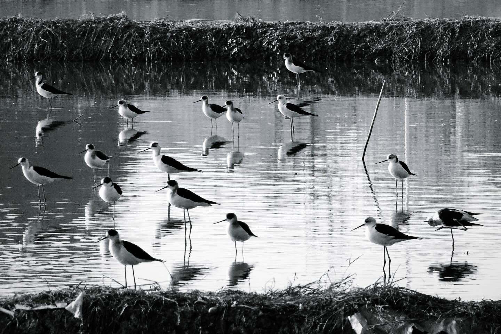
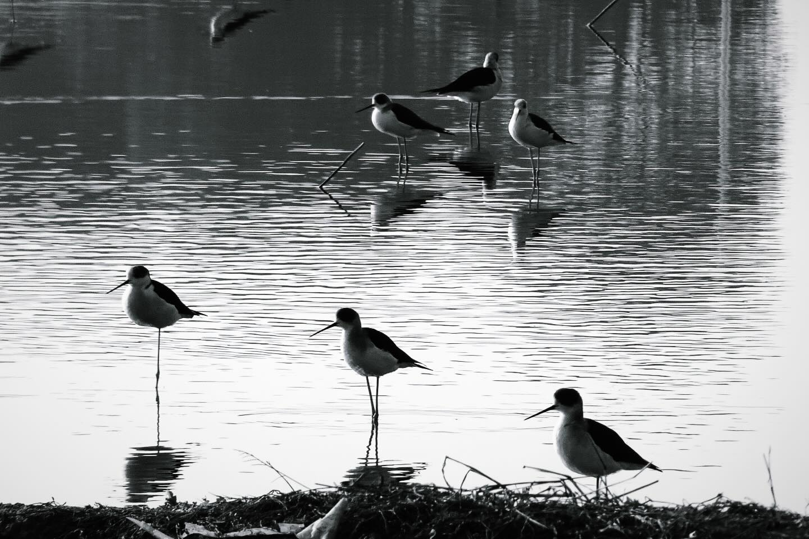
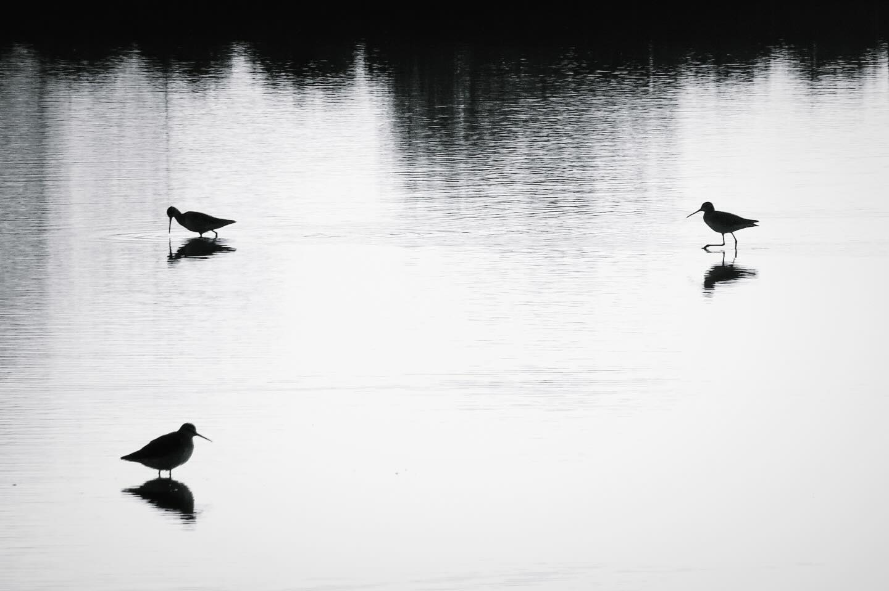
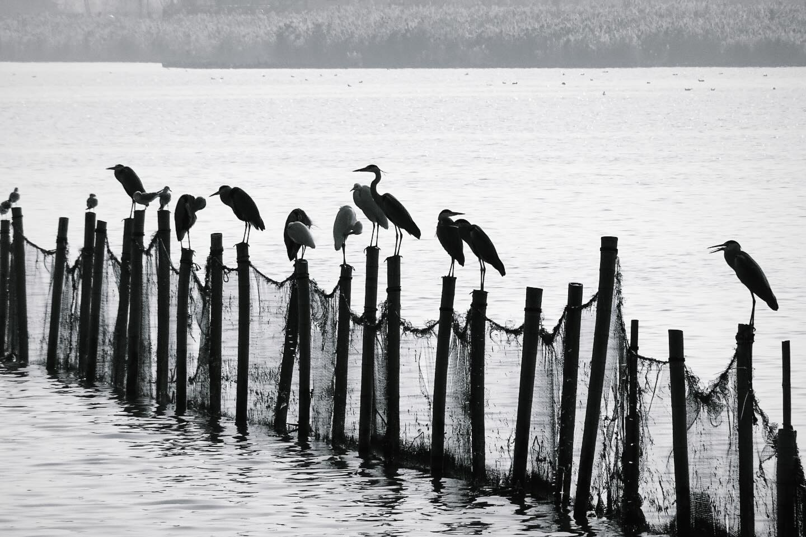
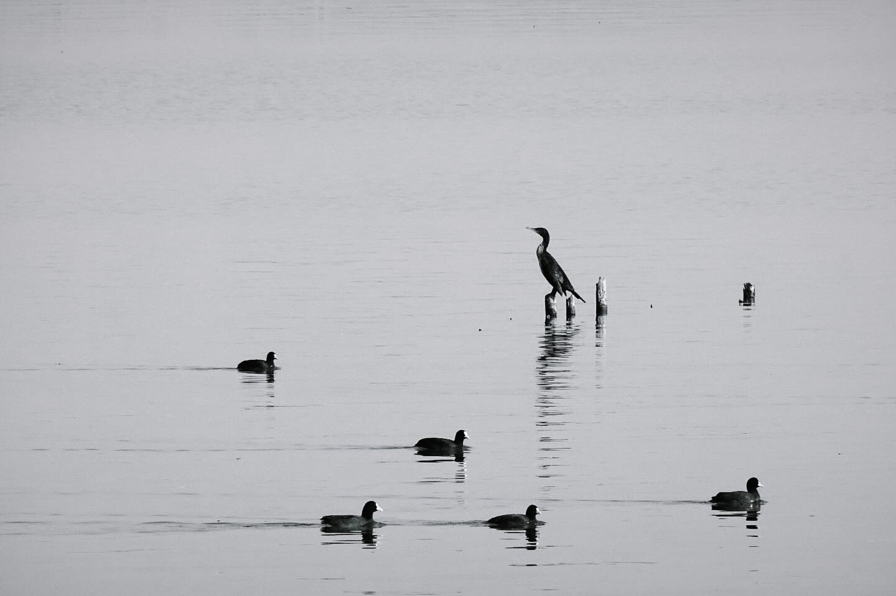
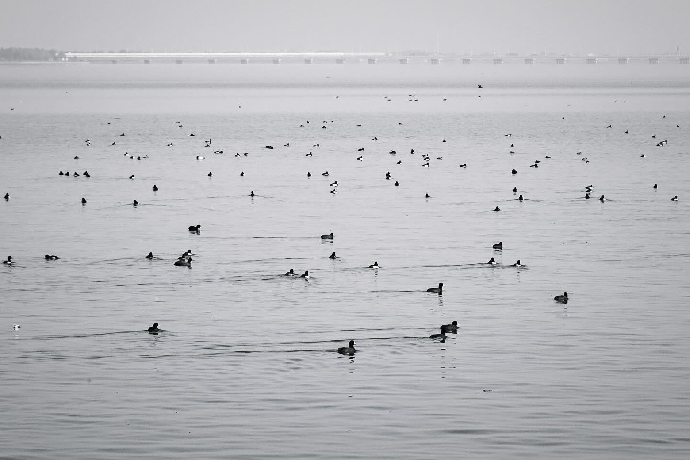

昨天去水田里转了一圈，发现苏州常见的水鸟之间亦有区别。

像黑翅长脚鹬就喜欢集小群一边鸣叫一边觅食，因为腿长所以吃水最低；鹤鹬一般和黑翅长脚鹬混群，泽鹬不多，也不爱叫，这两种鹬水线都很高，感觉会随时歪倒在水里；扇尾沙锥喜欢缩在田埂边用保护色作掩护行动，不会大大方方地站在水田中间。湖上有很多钓鱼佬（我们这儿苍鹭最多，也有鸬鹚和大小白鹭）和鸭鸭，终于成功加新了两种鸭鸭：凤头潜鸭和绿翅鸭。鸭鸭们一般会离岸边比较远，而鸊䴘们和骨顶鸡们则会漂到离岸很近的地方。还第一次看到了长得像个发霉橘子的北红尾鸲。

纤细的水鸟们在水面上就像水墨画一般，真的好美。

---

I went to paddy fields yesterday, and I found the behavior of common shorebirds in my hometown quite interesting. 

Black-winged stilts like to gather in small groups to sing and find food together, and because they have very long legs they can easily keep their bellies away from water. 

Spotted redshanks walk around together with stilts, and marsh sandpipers are less common and more shy. They both have shorter legs so when they walk around, their bellies would touch the water. 

Unlike other shorebirds who stand in the center of the ponds, snipes like to hide beside the ridges, their striped backs are very good protection to keep them away from the eyes of predators (and me 🥱). 

Herons, egrets and cormorants stand on the seines, while ducks, grebes and coots float on the lake. 

Grebes and coots are more likely to be found near the shore, while you can only see ducks in the center of the lake.

This place actually does not worth its ticket price (¥30/person) in a common sense but it’s a paradise for birders. Every person I met in the park have binoculars/a camera in their hands, which is hilarious
