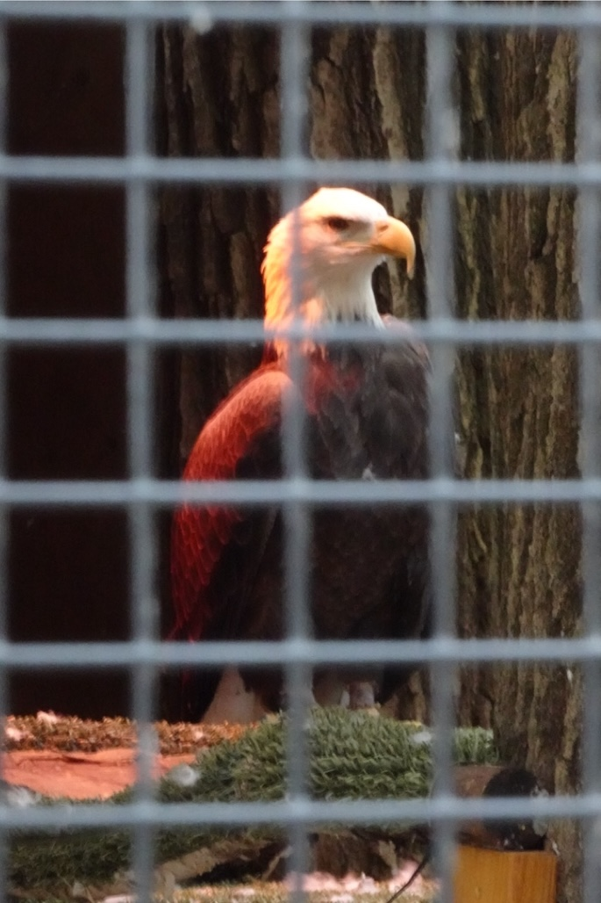
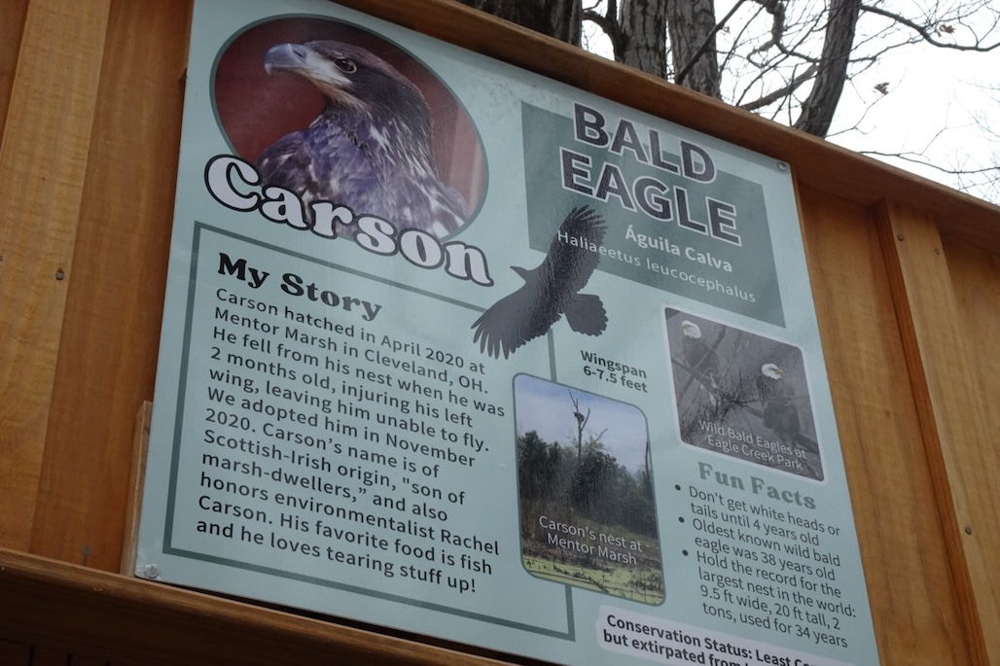
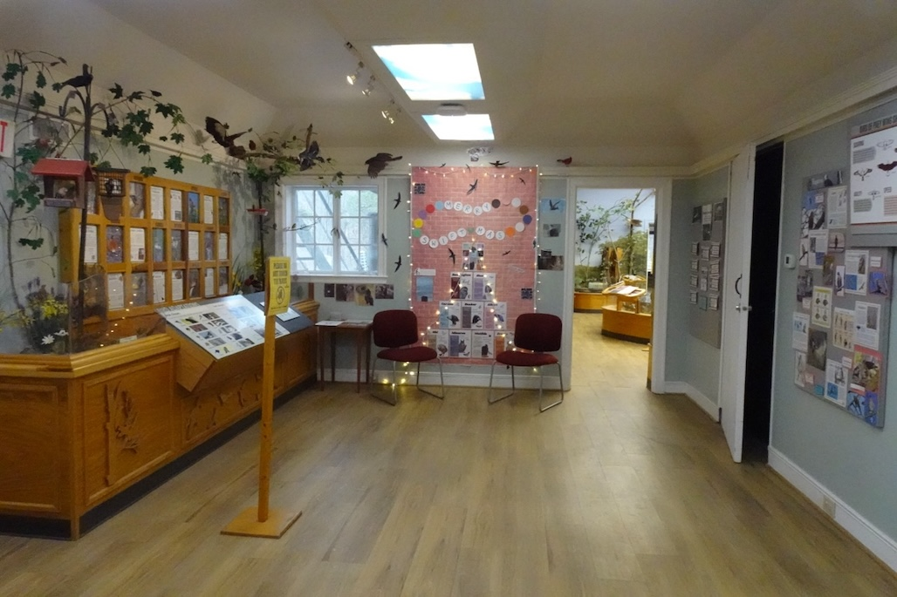
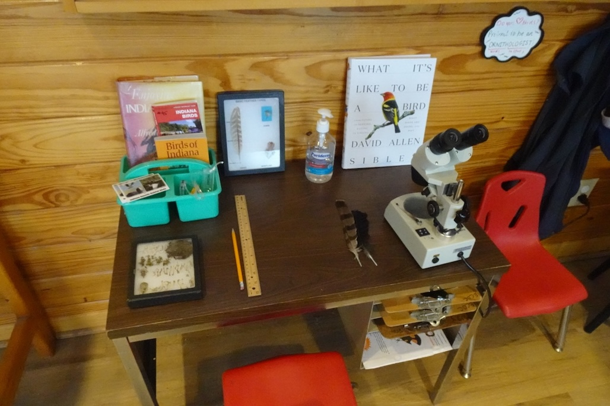
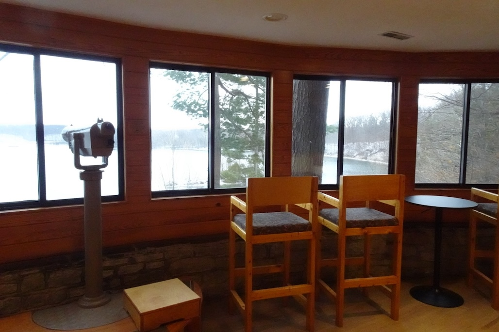
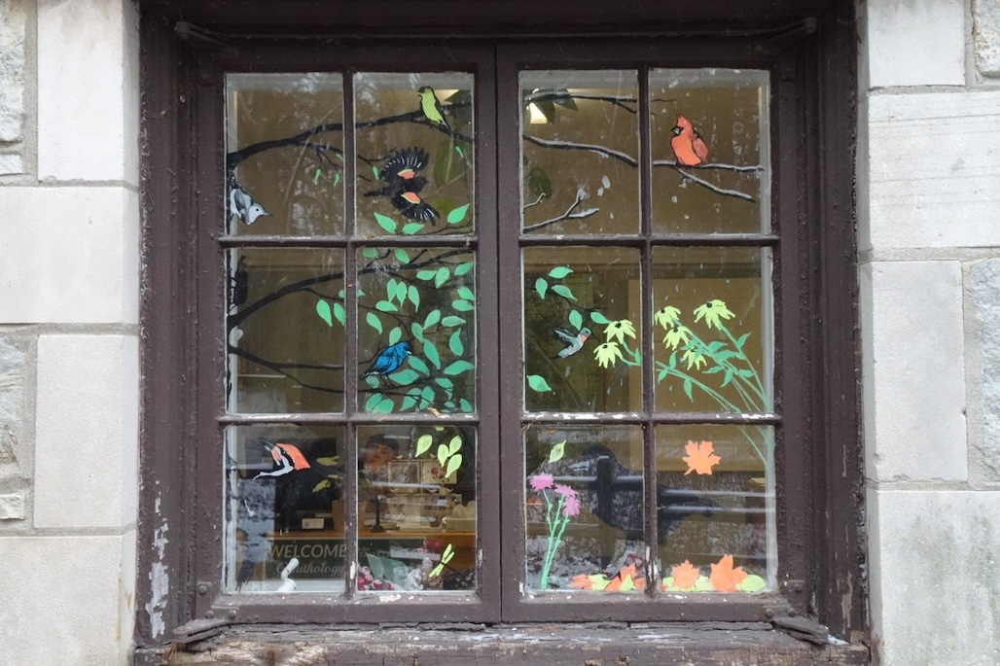
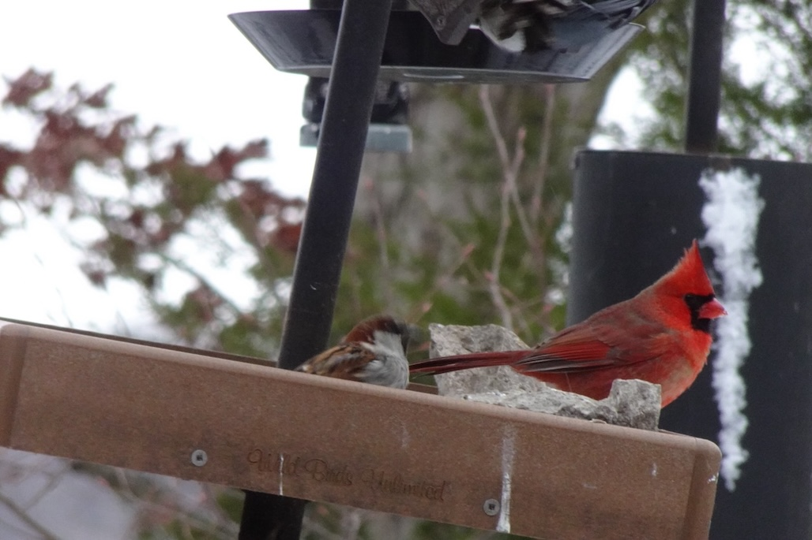
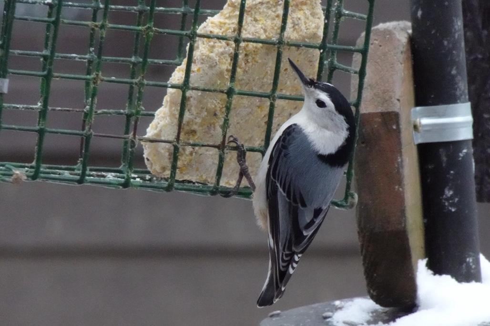

This weekend I visited *Eagle Creek Park* near Indianapolis with my friends. It's freezing outside, so we only walked ~10 minutes on the trail, and saw some Canada geese, ducks, gulls, and coots on water from a distance. I could only identify Canada geese by their larger size compared to other birds >_<

To my surprise, [the Ornithology Center at the Eagle Creek Park](https://eaglecreekpark.org/ornithology-center/) is really good. The ornithology center contains a wild birds rescue center (they've rescued a turkey vulture, a bald eagle, and a few owls), a little museum (a great collection of books, field guides, specimen, and memes), an indoor observation station facing the lake (helps a lot when it's freezing outside, and you can borrow binoculars), and a few bird feeders (you can sit on chairs - indoor or outdoor - and watch birds enjoying their time, and don't worry, there are anti-collision stickers on the windows). On the windows facing the trail, there are great window paintings - I really like the loon window, and hopefully I can see them during the spring/fall migration periods!

A very dedicated team curated everything. I pay due respect to all people working there, and we had a great time. Definitely want to visit there again in the future when it's warmer!  

[Eagle Creek Park eBird Page](https://ebird.org/hotspot/L157179)

---

::: photo-row
{group="row"}

{group="row"}
:::

::: photo-row
{group="row"}

{group="row"}
:::

::: photo-row
{group="row"}

{group="row"}
:::

::: photo-row
{group="row"}

{group="row"}
:::
