[上一篇](../260117_travel_baltimore_music/index.qmd)写了巴尔的摩的音乐，这次想写写火车和铁路。

众所周知，美国是一个公路上的国家，大多数地方私家车是一种刚需，但刚来美国的我其实感触不深。两年前的夏天我去西雅图拜访朋友，她听说我经常乘火车跑到费城和华盛顿一日游，很羡慕，说在西部就不可能有这种事，所有的城市都离得好远！当时的我不以为然。现在搬到一个每周只有两班火车进出的小镇，终于明白前两年的自己可是享受到了当代美国为数不多的方便的城际客运铁路：东北走廊（Northeast Corridor）。真是身在福中不知福！

作为一个在中国长大的00后，我对公共交通抱有一种理所当然的态度：线路是国营的，候车厅和车厢是标准化的，火车票的价格是固定的，且比坐飞机更加方便、便宜、快捷。搬到美国后发现一切都不一样了。美国的铁路系统在19世纪随着第二次工业革命蓬勃发展，在19世纪末期到达巅峰，铁路公司们互相竞争，同一个地区甚至可能有四五家公司抢夺同一条运输线路上的客源和货源；20世纪中后期，铁路运输随着公路和郊区化的兴起逐渐衰落，客运线一度亏到只能让国家出手来救的地步，不然美国堂堂一个发达国家就不存在火车旅行了——这就是美铁公司（Amtrak）的由来。

巴尔的摩的铁路系统就是其中一个很有意思的例子。

## 宾州站与东北走廊

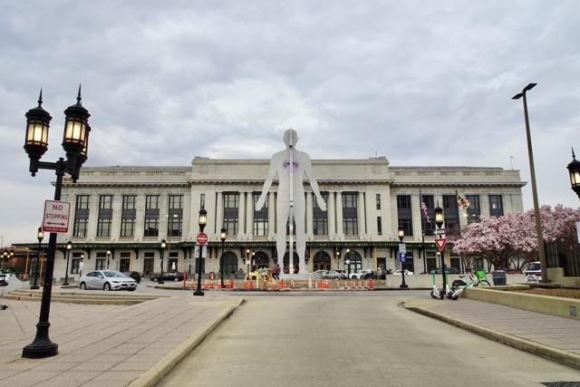{group="lb"}

::: column-margin
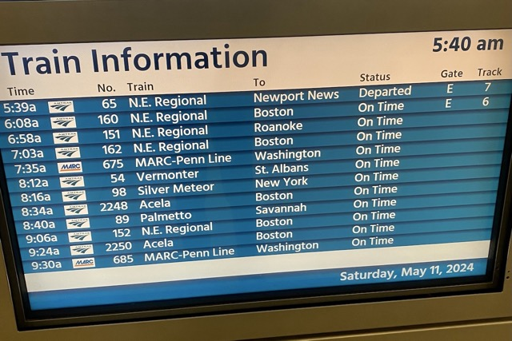{group="lb"}

**N.E. Regional**: 东北局域线，美铁在东北走廊的普通线路。

**Acela**: 美铁的高速线路，这个词是又*快*又*棒*的意思（*Acce*leration & Ex*celle*nce）。

**MARC-Penn Line**: 巴尔的摩到华盛顿的通勤线。
:::

巴尔的摩的火车站叫宾州站（Penn Station），座落在市区北部的Mount Vernon街区，落成于1911年，是一座美术学院派（Beaux-Arts）建筑。车站前面有供接送车辆使用的小小的圆形广场，外立面饰有庄严的罗马柱，入口挑高大厅的天花板上装着漂亮的圆形玻璃顶。它现在为美铁所有，经过巴尔的摩的客运火车都会停靠在这个车站。

每个初来乍到巴尔的摩的人看到这个车站都会产生两个困惑：一，车站前面那个苍白的、巨大的、发光的、半男半女的人形雕像到底是什么？二，为什么一个巴尔的摩的车站却叫宾州站？这就和苏州的火车站却叫浙江站一样荒谬。第一个困惑很快就得到了解答：那座雕像就叫做“男人/女人（Male/Female）”，落成于2004年，是美国雕塑家Jonathan Borofsky的作品。这座现代风格的雕塑在落成后就因为与环境格格不入而饱受争议，甚至被称为“巴尔的摩最古怪（kinky）的雕塑”；在一则2021年的新闻中[@gunts_baltimore_2021]，这位雕塑家为自己辩护说，最初的构想是把这个小小的圆形广场做成一个绿树成荫的公园，让来往的市民有休息的地方，而不是让这座雕像孤零零——不如说*光溜溜*地——站在那里；更糟的是，*“移动这座雕像要花掉15万至25万美金，并且也没人知道该把它移到哪里去”*。我个人倒是蛮喜欢这个雕塑的，Mount Vernon是一个颇有艺术气息的街区，这个大雕塑和旁边马里兰艺术学院（MICA）的建筑群很相配，那颗会发光的心脏也给灰扑扑的街道增添了一丝亮色。第二个问题直到一周前才在和ChatGPT老师的热聊中得到解答——宾州站落成时叫做联合车站，在上世纪是宾夕法尼亚铁路（PRR）的所有物，在1928年改名为宾州站。同属PRR的纽瓦克和纽约火车站也都叫做宾州站，现在也都是美铁的资产了。

美国的火车没有安检，车会在发车前10分钟左右到站，宾州站也不大，不用像赶上海站的末班车一样跑马拉松。东北走廊的车一般都在E站台发出，站台没有闸机，车票也没有固定座位（可以去坐餐车，桌子比较大），只要在检票员查票的时候出示车票就好，他们会在每个人座位上方行李架的缝隙里塞一张小纸条作为标记。卫生状况略微堪忧，但我很喜欢美铁宽敞的座位，运气好的时候可以一人独占两个。

::: photo-row
{group="lb"}

{group="lb"}
:::

从巴尔的摩出发往北乘一个半小时火车就能到达费城。这一段铁路叫费城-威明顿-巴尔的摩铁路（PW&B），建成于19世纪30年代，在1881年被PRR收购，横跨切萨皮克湾和特拉华湾北部，坐靠窗的位置可以时不时看到美丽的海景，有时还能看到彩虹。

费城的车站叫30街站（30th Street Station），位于思故河畔，是一座落成于1933年的宏伟的新古典主义建筑，也是PRR时代的铁路总站。进站前的一两分钟，火车会驶过I-76快速路下方，视野一下子变得灰暗；但进站后走上台阶就能看到非常宽敞的装饰艺术风格挑高大厅。大厅里最引人注目的就是那座12米高的黄铜雕像“复活天使（Angel of Resurrection）”，它是PRR为了纪念在二战期间牺牲的1307位员工而设置的纪念碑，雕塑的主题是大天使米迦勒从战争的烈焰中救起一位阵亡士兵的灵魂。走过主厅侧边的小走廊就能进入机场线的站台，可以从这里乘火车去费城国际机场；进入车站需要买票过闸机，实际的站台在二楼，有漂亮的玻璃拱顶，一群鸽子在站台里飞来飞去。机场线会绕过费城的大学城，能看到宾大和德雷塞尔大学的校内建筑。

::: photo-row
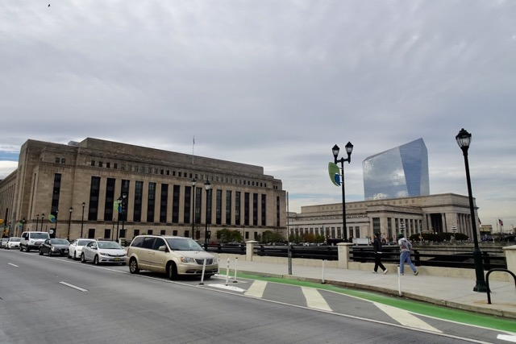{group="lb"}

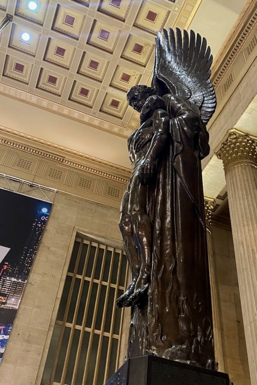{group="lb"}

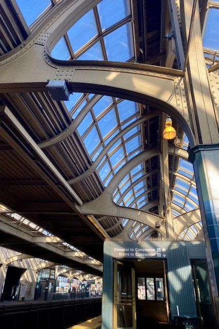{group="lb"}
:::

从费城往北再坐一个多小时火车就能到纽约。进纽约的过程很像《疯狂动物城》或者《饥饿游戏》里的场景：在纽瓦克站稍作停靠后，火车会驶入一大片荒凉的沼泽地，从窗户望出去能看见生锈的铁轨、废弃的厂房，以及远处若隐若现的曼哈顿天际线；进入曼哈顿岛前，列车会猛地扎入北河隧道——这是一段有110多年历史的老隧道，建于哈得逊河下——最后从位于31街与33街之间的宾州站钻出来。

::: column-margin
{group="lb"}
:::

不同于费城火车站的宏伟庄严，纽约的宾州站让人摸不着头脑，因为它是一个*地下建筑*。身为世界第一的大都市（宾州站也是美铁和整个西半球最繁忙的火车站），最大的车站居然没有一个大厅，这多少有点不合情理。我第一次去纽约玩时到站直接转了地铁去下城区，离开的时候乘的是飞机，并没有意识到这个设计的不合理之处。直到后来又去纽约，傍晚捏着手机导航站在33街，下意识地寻找一个高耸的单体建筑，却彻底傻了眼；好不容易找到了位于麦迪逊广场花园（图中左侧的圆形体育馆）下方的入口，面对神似00年代老商场的地下大厅，我在站台门口三过而不入，直到站到车门口之前都在怀疑自己是不是走错到了什么商场里。这种窝囊的体验专业人士早在1962年就吐槽过了——美术史学家Vincent Scully这么说道：*“人们曾如天神般进入城市，现在却像老鼠一样仓促逃窜（One entered the city like a god. One scuttles in now like a rat. ）”*[@riscica_great_2013]。

让Scully感叹“如天神般”的宾州站地上部分于1910年建成，和巴尔的摩的宾州站一样，也是一座美术学院派建筑；可惜的是，二战后，随着美国铁路客运的衰落，PRR把宾州站的上空权卖了，这座华丽的大厅随后在60年代被拆除，后来建成了现在的麦迪逊广场花园。据说这件事还促成了美国的历史建筑遗产保护运动。纽约人也对此十分不爽，以至于他们终于在接近60年后的2021年又建成了一座新的地上候车厅来弥补这个历史错误——这便是位于第八大道对侧的莫尼汉列车大厅，由曾经的法利邮政大楼改造而成，和被拆除的旧宾州站候车厅同由建筑事务所McKim, Mead & White设计，同样是一座美术学院派建筑。可惜我目前还没有机会去看看这座大厅。

::: column-margin
**上空权**——拥有和使用土地上方的空间的权利。在纽约这种寸土寸金的地方，这个概念很重要。
:::

## 旧时代的遗迹：巴尔的摩-俄亥俄铁路

之前我们讲到，建于1911年的巴尔的摩宾州站是PRR的资产；但在上一篇文章里我们也提到过，最早通车于1830年的巴尔的摩-俄亥俄铁路（B&O）是美国的第一条铁路。如此辉煌过的大公司居然会把本地的客运线拱手让人吗？这个故事要从B&O公司建立之初说起。

位于切萨皮克湾北部的巴尔的摩以航运发家，这里的“海盗正规军”私掠船曾在独立战争期间合法劫掠英国船只，赚了不少；但与同为港口城市的纽约不同，纵使狭长的切萨皮克湾给巴尔的摩提供了良好的深水港，它却缺少像伊利运河/哈得逊河那样可以贯通美国中西部粮仓与大西洋沿岸的水运通道。巴尔的摩的商人自然不会愿意把航运带来的巨额利润全盘交给北边的纽约。1827年，在考察了当时的英格兰铁路系统后，一群商人和银行家聚集在巴尔的摩内港西侧的Mount Clare成立了B&O铁路公司，目标是建立一条连接巴尔的摩与俄亥俄河的铁路，这样中西部的粮食就能快速地运抵东部的港口。在之后的60年间，当年开会的地方建成了Mount Clare站和附属的扇形机车库；在1953年，车站被改造为B&O铁路博物馆，存放着纪念B&O公司与美国铁路运输辉煌年代的250件机车车辆。目前，博物馆不仅供游客参观，也对外开放活动场地预约[@noauthor_museum_nodate]。

::: photo-row
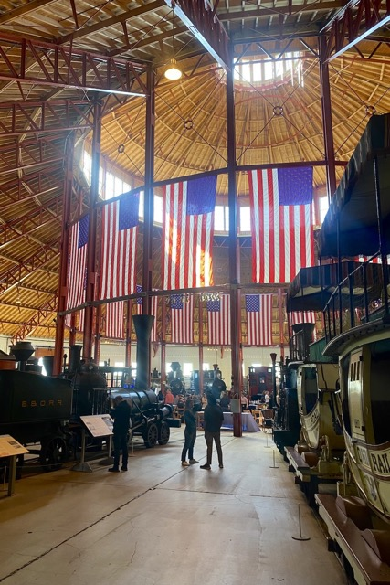{group="lb"}

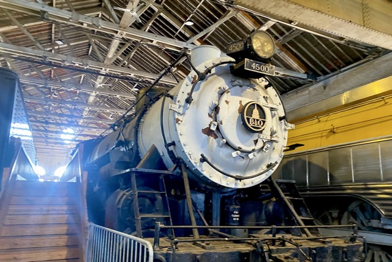{group="lb"}
:::

B&O旗下的第一条铁路在1830年通车，连接了巴尔的摩与西侧的小镇埃利科特城；1836年，铁轨铺到了马里兰、弗吉尼亚与西弗吉尼亚州交界处的哈珀斯渡口，B&O在这里修建了横跨波多马克河的铁路大桥；1852年，铁路修到了西弗吉尼亚的芒兹维尔，到达了原定的目的地——俄亥俄河；一年后，轨道修到了西弗吉尼亚的惠灵，这是南北战争前B&O铁轨所延伸到的最西端。南北战争后，美国迎来了铁路建设的高潮。1877年，铁路公司的雇员因为不满降薪而在西弗吉尼亚的马丁斯堡发起了震惊全美的大罢工，罢工行动持续了52天，蔓延到了周围的其他五个州，最终在国民警卫队和联邦军队的镇压下结束。1881年，B&O在中大西洋地区的铁轨基本铺设完毕，中西部产的粮食得以源源不断地运到巴尔的摩，再从这里装货并运向欧洲。

::: column-margin
{group="lb"}
:::

从19世纪中叶到20世纪初，B&O和PRR一直在中大西洋地区的交通要道上较劲。早在B&O进军宾州西部的匹兹堡时，PRR就曾向宾州政府施压，试图靠阻挠B&O的西进获得在宾州铁路运输上的垄断地位。在1881年，两家公司也曾抢着要收购连接巴尔的摩和费城的PW&B铁路[@maryl_maryland_nodate]。作为东部重镇和B&O的老家，巴尔的摩留存了不少两家公司掰手腕的痕迹。从宾州站往西走两个街区，就能看到B&O当年的主火车站：建于1896年的Mount Royal站，它是一座优雅的新文艺复兴建筑，屋顶覆盖着典雅的红陶瓦，并建有一座46米高的钟楼。19世纪末，为了和PRR的华盛顿-纽约客运线（也就是现在的美铁东北走廊）对抗，B&O推出了Royal Blue客运火车，这种火车漆成华丽的宝蓝色，以豪华周到的服务著称，一定程度上弥补了它不能直接进入曼哈顿岛的遗憾——PRR在1910年修建了横穿哈得逊河的北河隧道，而B&O的乘客只能先在泽西城下车，再换乘轮渡入岛。这段线路也包含了世界上第一条投入干线运营的电气化铁路：铺设在巴尔的摩市区Howard Street下方的电气轨道“Baltimore Belt”使列车得以在城内快速穿梭，连接了B&O城南城北的铁轨，
让从华盛顿到纽约的漫长旅程变得一气呵成。Mount Royal站便设在这条地下轨道的北端，这也是它位于一个“坑”里的原因。

::: photo-row
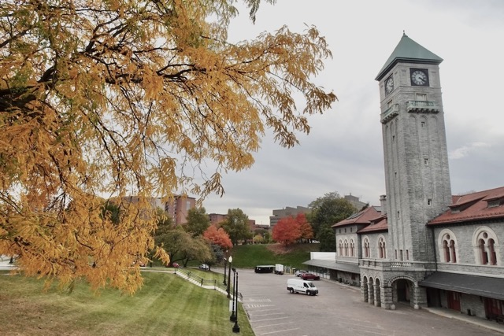{group="lb"}

{group="lb"}
:::

1958年，B&O放弃了巴尔的摩以北包括Royal Blue在内的所有客运服务，曾经的客运铁路成了货运线（后被相继重组为Chessie System 和CSX），这座火车站也随之废弃。至此，从巴尔的摩北上的客运任务全部落在了属于PRR的宾州站肩上，直到PRR最终因破产被美铁和联合铁路公司重组，而宾州站也成为了美铁的资产。幸运的是，Mount Royal站的旧楼并没有像纽约宾州站一样被推平，而是被MICA接手。现在，这栋楼是艺术生们上课和展示作品的地方。这里离马里兰大学、巴尔的摩大学和剧场The Lyric都很近，秋天树叶会变红，春天会开满樱花，那片碧绿的草坪是散步遛狗的好地方。

::: column-margin
![1922年的内港周边铁路图，橙色：PRR；蓝色：B&O。[@disney_railroad_1922]](figs/map.jpeg){group="lb"}

当年在巴尔的摩“混战”的铁路公司不止B&O和PRR两家。霍普金斯北校区Wyman Park边建于1918年的混凝土高架桥就是马里兰-宾夕法尼亚（M&P）铁路公司的财产，直到50年代，M&P的火车都从桥洞下穿行而过。

:::

蒸汽时代给巴尔的摩市区留下了很多痕迹。成为旅游区之前，内港和Fell's Point曾密布着码头与仓库。内港北边的东西向大道Pratt Street十分宽敞，19世纪中期这条路上曾经铺满B&O的货运铁轨，负责把货物一批批运向码头；这种在城市主干道上强行铺设货运铁轨的做法也曾引发大量争议，因为蒸汽火车的隆隆声打乱了行人和马车的日常步调，市民对此十分不满[@schley_steam_2020; @themetropoleblog_bo_2022]。Fell's Point的Thames Street也能看到PRR铺设的铁轨，现在的意大利式餐厅和唱片店都曾经是工人们装卸货物的地方。

1904年，巴尔的摩市区发生大火，紧邻内港北部的B&O总部大楼和PRR巴尔的摩分公司大楼都被烧毁；巧合的是，两个公司都指派了同一所建筑事务所Parker & Thomas设计新的办公大楼。座落在Charles Street南端的B&O新总部大楼和前面提及的很多车站一样，也是一座美术学院派建筑，门口的大理石拱廊上装饰着古罗马的交通与商业之神墨丘利与一尊代表“工业进步”的人像，13层高的壮观大楼尽情地展示着B&O作为本地龙头企业的骄傲。PRR的楼座落在两个街区以外，是一座较为朴素的红砖建筑。在蒸汽火车不再轰鸣着穿过城市的当下，两座建筑都已移作他用——B&O总部大楼成了金普顿旗下的摩纳哥酒店，PRR的办公楼则开着一家纹身店。

::: photo-row
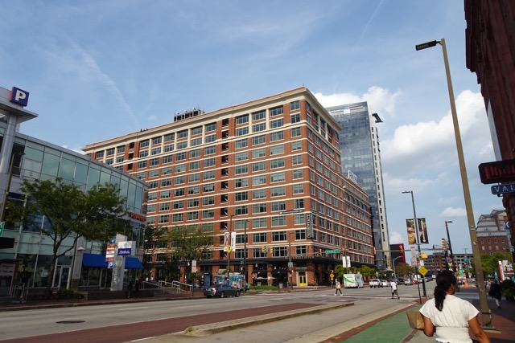{group="lb"}

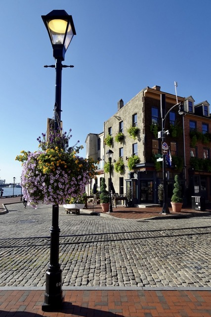{group="lb"}

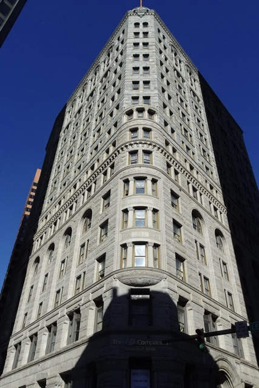{group="lb"}

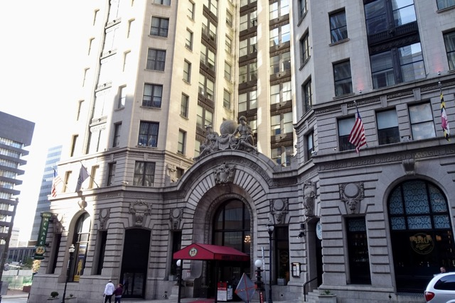{group="lb"}
:::

## 复兴轨道客运：马里兰运输局

铁路客运的黄金时代结束了，但巴尔的摩复兴轨道公共交通的尝试并未停止。常去华盛顿的人一定知道马里兰通勤铁路（MARC）的存在：只要花上9美元，从宾州站乘一个小时火车，就能快速到达南边的华盛顿特区。这便是全美最快、最繁忙的通勤铁路——属于马里兰运输局（MTA）的MARC-Penn线。这条线路从1984年开始由美铁代理运营，继承了PRR的旧铁轨，从位于萨斯奎哈纳河口的佩利威尔发出，途径马里兰的各个小城（包括位于汉诺威的BWI机场），最后到达华盛顿。除了巴尔的摩的宾州站，沿途的各个小站大多没有华丽的砖石结构建筑，但简单的钢架木结构站台在绿树的掩映中也别有一番风情。身为华盛顿的通勤线，这条线上最常见的乘客便是西装革履、提着公文包的联邦雇员，有时能听见他们乐呵呵地谈论工作八卦，但大多数时候他们只是一言不语地盯着前方，等着上班或者回家。

华盛顿特区的联合车站（Union Station），毫无悬念地，也是 B&O 与 PRR 两大铁路巨头鼎盛时期的产物。不同于双方在巴尔的摩的明争暗斗，这座位于国会山东北角、落成于1908年的新古典主义杰作是两家公司合作的结果。车站的外墙以联邦首都特色的洁白大理石砌成，辅以庄重的罗马式柱廊与拱门；正门口的屋檐上矗立着六尊名为“铁路的进步（The Progress of Railroading）”的雕塑，分别为代表火的普罗米修斯，代表电的米利都的泰勒斯，代表自由的忒弥斯，代表想象力的阿波罗，代表农业的刻瑞斯，和代表力学的阿基米德。车站的站台和候车厅处在同一层，旅客下车后，穿过低矮的候车厅，便能进入金碧辉煌的玻璃拱顶大厅。每逢岁末，大厅里会树起高大的圣诞树，唱诗班会在这里现场表演，悠扬的歌声让美东下着冷雨的夜晚都变得温暖起来。

::: photo-row
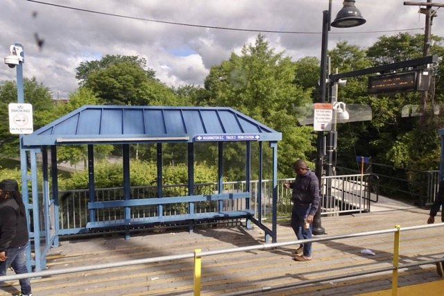{group="lb"}

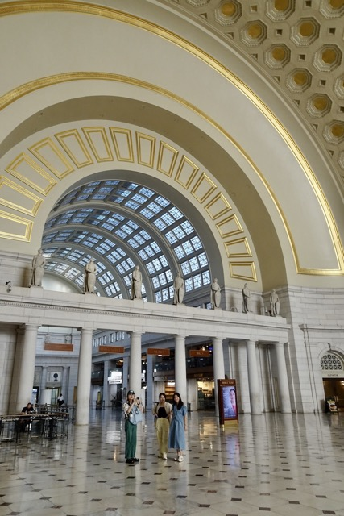{group="lb"}
:::

联合车站还可以换乘华盛顿的地铁Metrorail。不同于美国多数城市地铁令人抱歉的设计和老鼠乱爬的卫生状况，华盛顿的地铁是现代主义建筑的杰作。地铁站由芝加哥建筑师Harry Weese于上世纪70年代设计，在当年豪华的联邦预算支持下，这些站台呈现出粗野主义的设计风格：使用清水混凝土砌成藻井式拱顶，采取全间接照明，柔和的光线配合着宽敞的岛式站台设计，营造出丝滑现代、近乎科幻的乘坐体验。联合车站也可以换乘城际交通巴士灰狗（Greyhound），但它令人不敢恭维的卫生与安全状况能瞬间把人从幻想拉回现实。

除了往返于佩利威尔与华盛顿之间的Penn线，MARC还有另外两条继承了B&O旧铁轨的线路：从华盛顿到巴尔的摩的Camden线，如今最鲜明的功能是把狂热的球迷们运往巴尔的摩金莺队的主场——Camden Yards，球场紧邻的红砖大楼曾经也是B&O的仓库；以及深入马里兰西部阿巴拉契亚山脉的Brunswick线。这两条线我都没乘过，希望以后能有机会能坐坐看。

MTA旗下的另一个公共交通项目是巴尔的摩轻轨（Baltimore Light RailLink），这条纵贯城市南北、连接市区和郊区的地上有轨列车线路于90年代开通，单程票价为2美元，承载着市政府让搬到郊区的人们重回市中心购物娱乐、振兴城市的愿望[@philipsen_community_2024]，但结果却不尽人意。在MICA/Mount Royal站附近，铁道环绕在艺术学院风格独特的建筑中，尚存几分日式铁道的娴静氛围；然而，一旦列车驶入Howard Street段——那条曾经属于Royal Blue的辉煌故道——周围的景色就变得不那么令人愉快了。80年代漫长的建设周期加上城市的人口流失成功把这条曾经繁华的商业街变得一片死寂。如今，路边的百货大楼墙皮剥落、空空荡荡，窗户布满灰尘，一些商铺甚至被木条钉死；铺设着轻轨铁道的街上少有行人，所有人都神色匆匆，街边躺着神智不清的流浪汉；CSX的货运列车则轰隆隆地从地下驶过。街上唯一的看点就是风格各异、颜色艳丽的涂鸦了。

::: photo-row
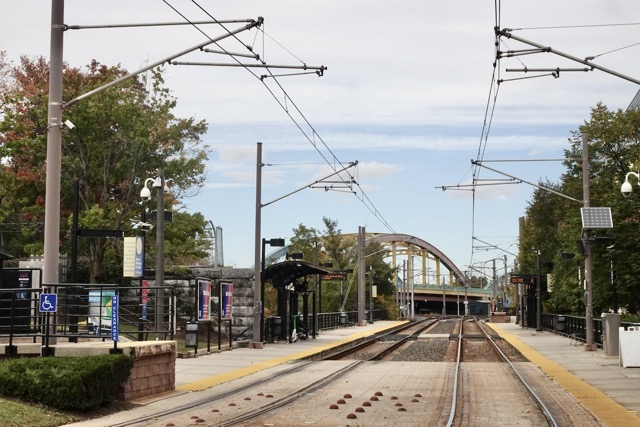{group="lb"}

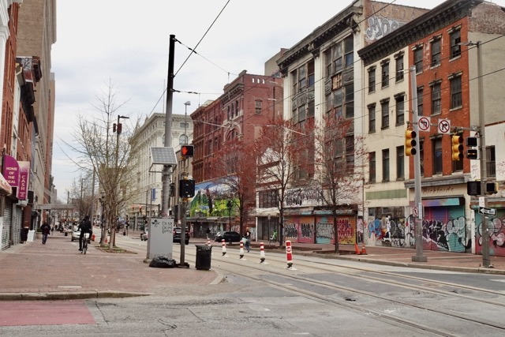{group="lb"}

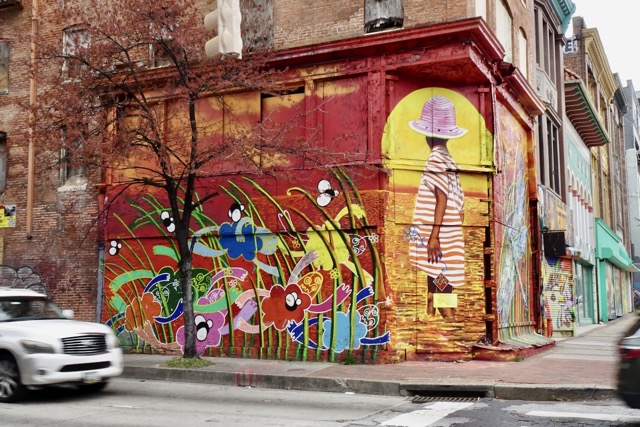{group="lb"}
:::

巴尔的摩的铁路系统见证了城市的兴衰。当基建热潮退去，旧日的设施有的摇身一变，成功转型为更符合当下需求的现代生活空间，有的被彻底拆除，有的则沦为城市身上令人不忍卒看的疮疤。漫步其间，我们依旧能听到铁路黄金时代的轰鸣在这座城市脉搏里的回响。

---

## 延伸阅读

- **美国铁路宅博客/论坛**

[The Trackside Photographer](https://thetracksidephotographer.com/) | [The Pennsylvania Roilroad Technical & Historical Society](http://www.prrths.com/) | [American Rails](https://www.american-rails.com/) | [Rails Acorss the Appalchians](https://appalachian-railroads.org/) | [Trainorders.com](https://www.trainorders.com/) | [O Gauge Railraoding Online Forum](https://www.ogrforum.com/forum-directory)

- **巴尔的摩历史**

[Baltimore Heritage](https://explore.baltimoreheritage.org/) | [The Baltimore & Ohio Railroad Historical Society](https://www.borhs.org/) | [An Engineer's Guide to Baltimore](https://www.ce.jhu.edu/baltimorestructures/Home.php) | [Maryland Department of Planning - Maryland Historical Trust](https://mht.maryland.gov/Pages/default.aspx) | [Baltimore Magazine - How Baltimore invented the modern world: from the B&O railroad to Frank Zappa, we chronicle all the ways baltimore changed America forever.](https://www.baltimoremagazine.com/section/businessdevelopment/how-baltimore-invented-the-modern-world/)

- **地图**

[B&O Railroad Maps, 1924](https://appalachian-railroads.org/homepage/railroads-across-the-appalachians/baltimore-ohio-railroad-bo/maps-of-the-baltimore-ohio-railroad-bo/) | [Railroad Map of Baltimore, 1922](https://jscholarship.library.jhu.edu/items/8bf2d6d5-94b6-4dad-a651-660a263fcdbd)
