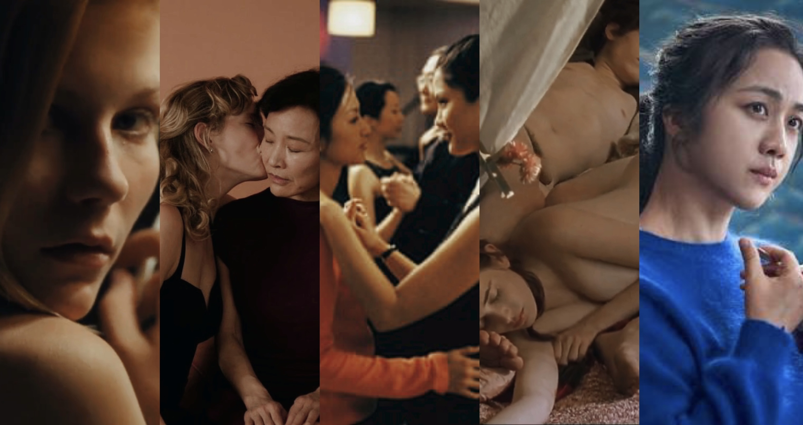
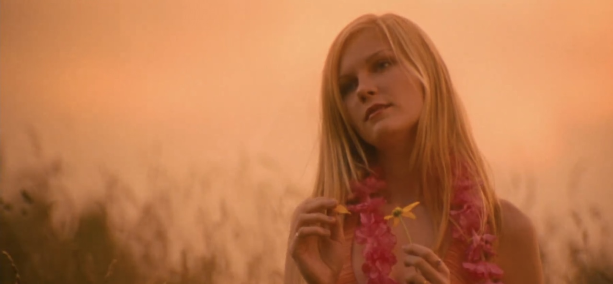
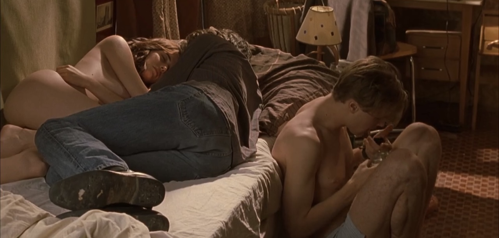
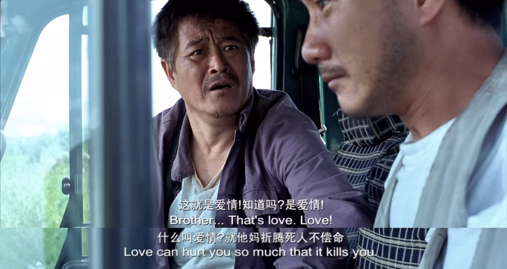
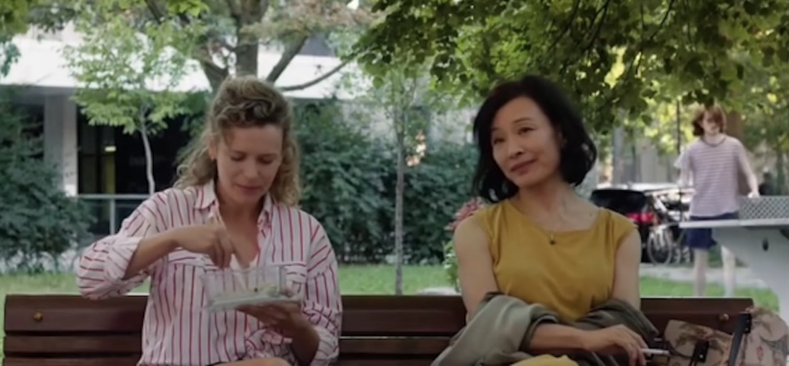

最近一口气看了六部电影，居然都不错，来写篇观后感卖卖安利。

从纽约回来的飞机上在《月光男孩》和《“呼啸山庄”》里犹豫一会儿选择了后者，于是坐立难安地度过了在周围人灼热的注视下（并不存在）看着男女主尬演尬操的两小时。下飞机后我指天发誓，一定要吃点好的来弥补这两个小时受的精神伤害。——这就是观影马拉松的缘起了：找到我的10分爱情片。TD;LR：真的找到了！

<link rel="stylesheet" href="https://cdn.pride.codes/css/bar_helpers.css">

::: callout-warning
剧透预警。部分裸露、自杀提及。
:::

{group="grp"}
---

## 处女之死 The Virgin Suicides {#1}

- 导演：Sophia Coppola｜年份：1999｜我的评分：8/10

马拉松的第一步是捡起了之前放着没看完的《处女之死》。之前在小红书上看别人分析Lana Del Rey和Olivia Rodrigo新专的sad girl aesthetic，提到了索菲亚·科波拉的这部电影。两年前看了她的《迷失东京》，很喜欢镜头和配乐，于是自然而然地去看了。这部讲述未成年人自杀的电影算不上是爱情片，但确实有一些青少年爱的成分在里面。

这部电影讲述的是80年代美国东海岸郊区的Lisbon五姐妹的故事，由小妹Cecilia的割腕自杀未遂开始，到姐姐们的相继自杀结束。Lisbon姐妹是数学老师的女儿，家庭氛围压抑而保守。性格敏感、喜欢幻想的小妹痛苦于生活的一成不变和大人们的无聊，决定在浴缸里割腕。被救起来后，家长们给Cecilia办了一个派对让她多认识认识同龄的男孩，希望让她开开心，但派对的虚伪和无聊让Cecilia再次失去了生活的希望，从窗口一跃而下。镜头继续拍摄着余下的四姐妹的故事：第二小的妹妹Lux被学校的橄榄球四分卫Trip Fontaine追求，Trip带着朋友们邀请Lisbon姐妹们参加了学校的homecoming ball。舞会上Trip和Lux被选为舞会的King与Queen，激动的两人遂当晚在球场上发生了关系，早晨Trip却独自离开，留下Lux独自一人。Lux的出格行为导致了家里人对Lisbon姐妹们更深的控制，被禁足的女孩们最终选择一起自杀。

{group="grp"}

看完电影，我最能共情的是13岁的Cecilia。她是一个塞林格小说式的人物：早熟，古怪，痛苦于现实与想象的差距。电影里一直关注着Lisbon姐妹的男孩们在Cecilia死后阅读了她的日记，对她的评价是：“Basically, what we have here is a dreamer... someone completely out of touch with reality, when she jumped, she probably thought she could fly”。心理医生问Cecilia为什么要自杀，你这么小，还没有经历过人生的痛苦。Cecilia说，医生，你从来没当过一个13岁的女孩。……简直就是我的青春期。也把白人中产郊区生活的压抑和虚伪表现得很好，所有的悲剧最后都变成了新闻头条和酒会的谈资，没人真的在乎姐妹们的想法。Trip出场的那一段用了滥俗美高青春片般的镜头语言，但最后换来的是最悲惨的结尾，看得心里闷闷的。

电影的镜头和音乐也非常好。导演选择使用旁观者（男孩们）的视角来讲述这一个故事，没有人真的知道女孩们心里是怎么想的，只留给观众一个侧影。原声是法国Ambient乐团Air的作品。

## 戏梦巴黎 The Dreamers {#2}

- 导演：Bernardo Bertolucci｜年份：2003｜我的评分：9/10

23年看了《燃冬》以后一直想看这部传说中是《燃》灵感来源的电影，甚至为此补了很多68年世界学运史，但一直拖延到了今天。这是一部非常“迷影”的电影，也拍得非常美。

来自美国的大学生Matthew在巴黎电影资料馆前遇见了同样痴迷电影的双胞胎姐弟Isabelle和Theo。趁着姐弟父母出门旅行的时刻，Matthew住进了他们家里，发现了Isa和Theo的乱伦关系，他们赤裸着相拥而眠，沉迷于猜电影的游戏，用带色情意味的惩罚戏弄对方。三人不顾屋外轰轰烈烈进行着的革命与战争，每天做爱、喝酒、谈论哲学政治与电影，直到街垒竖了起来，一支燃烧瓶被扔进房内。支持和平示威的Matthew退入人群，注视着姐弟双双投入街头革命的火焰之中。

之前在朋友的推荐下看过《狄拉克海上的涟漪》，大概知道68年的美国年轻人生活是怎么个事，这部电影让我了解了同一时间法国年轻人的生活，不得不说真是比骨子里很保守的美国人要浪漫/淫乱很多。Isa戴着黑色的长手套站在门框的阴影里扮作断臂的维纳斯。Matthew和Isa在厨房里第一次做的时候，Theo看了他们两眼，漫不经心地转过身去煎蛋。电影的中段，三人泡在同一个浴缸里洗澡，经血从Isa身下涌出染红了浴缸，Matthew吓了一跳，Isa却笑他，说别怕，你应该感到庆幸才对，这样的时刻一个月只有一次。真是让我感到了文化冲击——这实在太先锋了。剧中Matthew向Isa和Theo索取一句“我爱你”，却被Theo不耐烦地敷衍；Isa和Matthew做完在房内休息，Theo自然地上床躺在Isa对面，两人额头对着额头，两具身体形成一个茧形，而Matthew则背对着他们坐在床下——这类细节中可以看出这对双胞胎是无法分开的，而无论他们多喜欢Matthew，Matthew始终被排除在外。……这样的三人行也很美味呢，思路真是打开了。

{group="grp"}

Matthew是这个家的外来者，也是美国文化的象征，他为人处世的态度显然比天真冲动的法国姐弟要成熟世故。Matthew被这对姐弟的奇异魅力迷住，但同时也无法认同这样的生活态度；他数次尝试打破姐弟之间畸形的联结，要求和Isa像正常情侣一样单独约会，Isa也试图对他敞开自己的内心，把他带到自己像公主房一样漂亮的小房间里亲热。但Isa在听见Theo给别的女孩播放曾给Isa播过的歌曲时崩溃了，痛苦地砸着墙吼Matthew让他离开。故事的最后，Isa在客厅里给Matthew和Theo用床单和枕头搭了一个小孩子玩的帐篷，三人喝醉了赤身露体地相拥。在我看来这是Isa彻底的逃避现实手段，回归童年，与外界彻底断联——但燃烧瓶把这个幻梦打破了，他们不得不慌慌张张地面对现实，被时代潮流吞没。

总之是象征意义很大的一部片子，但想象这样的情节真实地发生在欧洲人的身上，居然也觉得很合理。我很喜欢。

## 分手的决心 Decision to Leave {#3}

- 导演：朴赞郁｜年份：2022｜我的评分：7/10

看这部的原因是朋友推荐，我们曾一起看过《色，戒》并为汤唯的魅力深深着迷，朋友说《分手的决心》是那种喜欢汤唯的人一下子就能get到的电影。

汤唯扮演的宋瑞莱是来自中国的蛇蝎美人，杀死了自己的母亲后偷渡到韩国，韩语不好，为了留下来嫁给了不爱的海关老头，做护工维持生计。沉迷登山的老头一日死于意外，表现诡异的瑞莱被列为犯罪嫌疑人。借着婚姻不顺的年轻刑警海俊之眼，我们得以欣赏这位嫌疑人迷人又危险的魅力，直到瑞莱爱上海俊，设下计谋再次杀人只为再次与他相见，最后在黄昏时刻把自己埋葬在大海中，留给海俊一个永远无法解开的谜题。

导演说这是一部冗长老套的爱情片。我个人的评价是这是一部汤唯梦男大作。瑞莱的角色和**汤唯此演员本身**强相关——在韩的中国人，沉静的气质——简直就是为她本人定制的人设。这部电影的故事线能否成立，全部在于海俊/导演/观众是否承认宋瑞莱是一个美到能让人一见钟情，飞蛾扑火地毁灭自己全部生活的美人这一点上。所谓Femme Fatale吧。感情发展多少有点突兀，身份迥异的二人忽然就爱得死去活来，我和海俊刑警的同事一样感到不可思议。很多对中国文化的引用让人觉得很搞笑，尤其是瑞莱母亲死前拿着《山海经》对戴着短假发的汤唯（扮相很灾难）说你要到韩国去找XX山的时候，太出戏了；瑞莱说几句中文就引一句孔子，你是刚学会写作文的中学生吗？但汤唯演得确实很好，眼神看似天真却又深不见底，举手投足间优雅又诱惑。不知是否刻意为之，瑞莱这个角色被演出了一种古代神女的感觉。把这个故事当成某种神话故事看就觉得合理多了。既然在搞爱情片马拉松，也点评一下亲热戏码，海俊和妻子的爱做出了一种死鱼般的质感，让人彻底对30岁后的生活失去了信心（不过信心会在看后面几部片子之后回来的）。海俊和瑞莱的亲密时刻是散步亲嘴哄睡听心跳，很韩很言情很抓马。

导演的分镜很有水平，最后的海景特别美。两人在审讯室里吃高级寿司那一段的暧昧氛围真棒，看完后我立刻给自己点了一份。

## 落叶归根 Getting Home {#4}

- 导演：张扬｜年份：2007｜我的评分：9/10

一下看了太多洋片把我搞出身份认同危机了，决定先看一部老中味特足的片子缓缓，于是这便是《落叶归根》。

赵本山演的经典公路片，讲的是农民工老赵把工友老刘的尸体从广东背回老家重庆下葬的故事。整部电影充斥着我不忍心剧透的黑色幽默，老赵的旅程串起了一个个行人的故事，卖血的、打劫的、敲竹杠的、给自己风光大葬的，当然还有负责和谐社会的警察叔叔，搞笑温情又反应社会现实，颇有人情味儿。最后落脚在三峡水库的建设上，好不容易把工友带回了家，家人却搬走了，家却成了一片废墟。赵本山的表演可以给满分。“尸体”非常敬业，整部电影僵着一动不动，围绕着尸体也开了特别多特别地狱的玩笑。取景主要在云南，拍得特别美。

{group="grp"}

整部电影里最喜欢的情节是：老赵从老刘的鞋底里摸到了430块私房钱，以为终于可以租到车送老刘回去，却被餐馆老板大敲竹杠，还揍了一顿。失去了所有希望的老赵在树林里挖了一个大坑，打算就地给老刘下葬。挖好坑后，他躺进坑里先替老刘试试大小。看着蓝色的天空和阳光下晃动的树梢，老赵很多天以来第一次感到真正的放松，冒出了随着老刘一起走的想法。在吊在树上的大石头砸过来的那一刻，老赵的求生本能发挥了作用，他下意识地躲开了石头，却被砸中了后背，晕倒在地上。醒来时他已在一户养蜂人家里，交谈中妻子揭开自己的面纱，露出了毁掉的半张脸：原来她曾因工厂爆炸毁容，周围人的鄙夷让她试图寻死，但丈夫选择放弃原来的工作带她和孩子远走他乡，开车养蜂，这样就能远离人群不怀好意的目光。——**活下去一定有希望**。温情，朴实，乐观，特别喜欢。养蜂人的孩子还念起了课文里的诗，“如果我的祖国是一棵大树，我就是一片树叶，我摇啊摇，我多快乐！”老赵在剧情后期再次搭上车时也念起了这句诗，但是把“祖国”改成了“家乡”：“如果我的家乡是一棵大树，我就是一片树叶，我摇啊摇，我多快乐！”

真的是非常棒的公路片。太喜欢了。决定继续看中国人的片子。

## 蒙特利尔，我的美人 Montréal, ma belle {#5}

- 导演：和晓丹｜年份：2025｜我的评分：9/10

冷静下来以后觉得分不应该给这么高，但我的mommy issue被陈冲演的凤霞狠狠地激发了出来。女主角凤霞是来自哈尔滨的一代移民，70后，在蒙特利尔和不爱的老公一起开便利店，来这里14年都不能流畅地说法语，去医院看病需要孩子翻译，融入不了当地的生活，把一双儿女当成生活唯一的念想。在下体干涩行房疼痛难忍后她终于决定不再压抑自己从青春期掩藏已久的的情感和情欲，在约会网站上认识了30岁的咖啡馆店员Camille，度过了一个美好的夏天，却又得同时承担背叛婚姻的代价——这样的故事。

{group="grp"}

这么一个有点刻板的设定被陈冲演得活灵活现，里面一些细节特别戳我。女儿的朋友们来家里聚餐时，凤霞夹着烟眯起眼睛看女孩们嬉笑玩乐，少女的长发在绿树掩映下飘舞，如梦如幻；凤霞给Camille示好的方式是给她包了饺子放在一个漂亮的蓝白条纹保温袋里；凤霞和老公刚来蒙特利尔的时候，愿望是去装饰着一大丛花的餐厅里吃饭；凤霞的床头柜里藏着她年轻时和暗恋对象的合影，90年代的女孩们衣着朴素，笑得开朗；凤霞和Camille在街角遇见跳舞的人，Camille自然地融入人群跳舞，凤霞矜持地在一边笑眯眯地站着鼓掌；凤霞走进女儿的房间，抱着她撒娇说想和她一起睡，不要离开她；甚至她对蒙特利尔/加拿大的单纯向往——觉得这里很有活力，很自由，喜欢街头随处盛放的鲜花和有活力的生活——都很“70年代妈妈”。就，我们这些mommy issue患者就好这一口？！看得我完全昏头了。有人说这个年纪的一代移民不会主动在孩子面前提起性、不会上约会网站，所以这个角色是不成立的，我想说老天啊，你们还是太小看老辈子了。Camille的角色反而有些刻板：辍学的人类学学生，也没有太展开，有点遗憾。

在电影里也看到了一些对一代移民身份认同的讨论，比如凤霞去咖啡馆时遇见Camille的女友们，得知凤霞的中国人身份后，一个短发女孩俯身急切地询问凤霞中国对LGBTQ群体的歧视和压制，凤霞尴尬得无所适从，转身就走——这是一个稍显咄咄逼人、并且把凤霞当成中国的话事人而不是“一个人”的问题——这样的microaggression大家应该都很熟悉了；但感觉导演在讲述这些故事的时候有些过于用力了，不够个人、生活化，所以也显得又些超现实，仔细想想有些刺挠。但这一切都被陈冲散发的成熟女人魅力抵消了。床戏也很色。她真适合演这种任性地陷入爱情的成熟女人角色，无论年龄多大了都透露着小女孩的娇憨气息。看完的时候我真心希望凤霞幸福。

## 面子 Saving Face {#6}

- 导演：伍思薇｜年份：2004｜我的评分：10/10

作为马拉松收尾的电影，看得心满意足。在《蒙特利尔，我的美人》影评里看到《面子》是陈冲演的另一部Les片（虽然没有演Les）于是兴冲冲地去看了，果然没有失望，非常好看，温情又搞笑。与《蒙》不同的是，《面》讲的是二代移民的故事，年代也更早，自然地就更轻盈乐观，有迪士尼电影一般的特质：真爱至上。

故事线简单又很“老中”：住在纽约的外科医生Wil是女同性恋，但她妈妈不接受这一点，一直给她介绍同龄男孩，还请人给她煎中药调理同性恋。在一次法拉盛的华人聚会上，Wil爱上了19年前有一面之缘的舞者Vivian，但此时家里又突发危机：Wil的妈妈在丧夫N年后又突然怀孕，并且拒绝告诉任何人孩子的爸爸是谁。德高望重的外公倍感丢人，将Wil的妈妈丢出家里，直到妈妈结婚给孩子一个名分前都不会让她回家。妈妈于是暂住到Wil家里。虽然自己丢了大脸，妈妈依然心安理得地在Wil面前扮演一个操心任性的妈妈角色，挑剔她的黑人朋友和女朋友（Wil不敢告诉她，说是朋友而已）；Wil则在生活的夹缝里硬撑。直到最后妈妈要嫁给不爱的人、女友也因为自己的懦弱失望分手的紧要关头，Wil才放下了面子，帮了妈妈一把逃出婚礼现场；妈妈也帮Wil和Vivian再次相见。最后大家肩并肩坐着，接受了一切，美好的未来似乎要开始。就是这样一个萌萌的故事。

看完以后最大的观感就是，真的好萌。Wil有那种迪士尼冒失女主的气质，扎着长长的马尾辫，衣着朴素，在该勇的时候怂怂的，直到心结被解开后才勇敢了起来；自由又性感的Vivian是所谓的引导型爱人，抱着手在自动售货机后面看着Wil的时候太美了，笑眯眯地提醒Wil两人小时候的事（Wil英雌救美的往事也像童话一样萌萌的），还借着教Wil如何在舞蹈中放松地倒下的机会撩她。Vivian在窗台边随意地倒在地上，姿态轻松又优美，镜头扫过Vivian舒展的姿态、自在的微笑和红色吊带上衣下露出的皮肤，Wil看得两眼发直。轮到她倒下的时候，Wil浑身僵硬，只能看着Vivian笑着越靠越近，最后怂得啪地一声倒在地上，随机两个人在地毯上亲嘴……太萌了，老天啊。亲密戏也萌萌的。陈冲演的妈妈依然有《蒙》里把我迷住的老派feminine妈妈气息，在女儿面前很任性。准备给妈妈相亲的时候，Wil说你别穿黑裙子，穿这个黄的多好看，妈妈说黄种人穿黄的不是更加成了黄脸婆？Wil不可思议地看着妈妈，意思是那你买这条黄的干嘛？妈妈理所当然地说大甩卖啦。最后妈妈穿着大红色的吊带裙见了相亲对象，女儿睁大眼睛一脸无语。这样的母女相处小细节很多，很贴近现实。非常可爱。带着穿着婚纱的妈妈坐公交逃婚的那一段也非常浪漫。

电影用一种轻盈又温情的态度来处理向保守的家人出柜这个严肃的话题，这一点我也很喜欢。Wil和妈妈的对话是这样的：“妈，我爱你……但我也是gay。”“你怎么可以同时说这样的两句话，一边说爱我，一边伤我的心。”直到最后两方的家长都接受了孩子的取向和爱人，Wil的妈妈还在问，“那你什么时候可以给我生个外孙？”爆笑。结尾停在这一刻我也很喜欢。导演真的很幽默。

