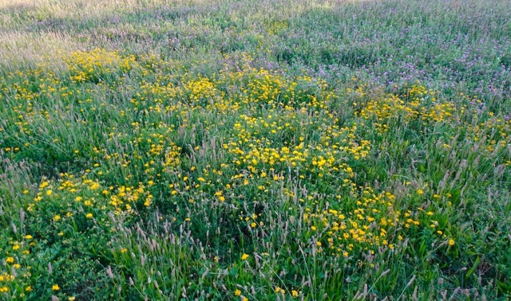
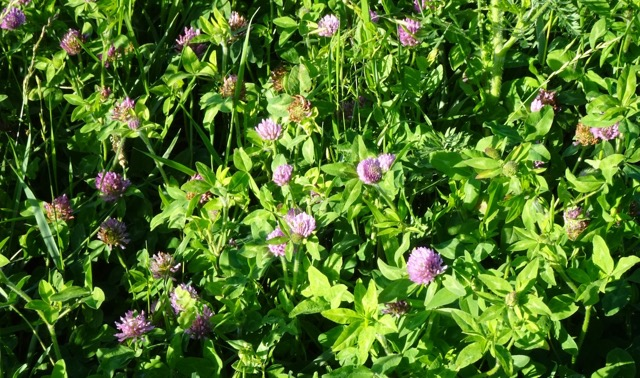
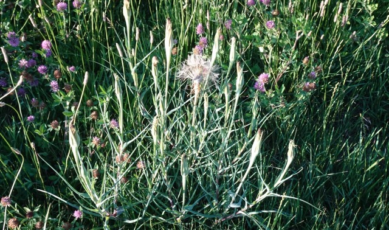
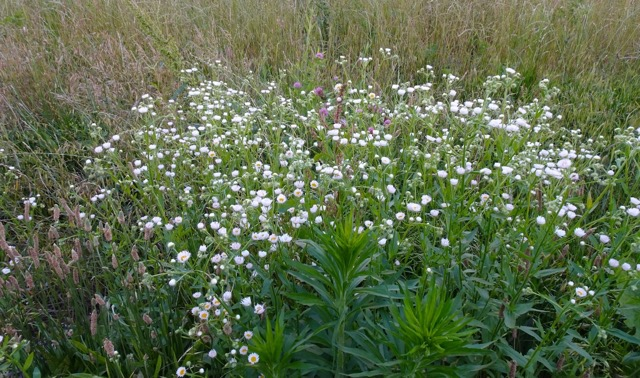
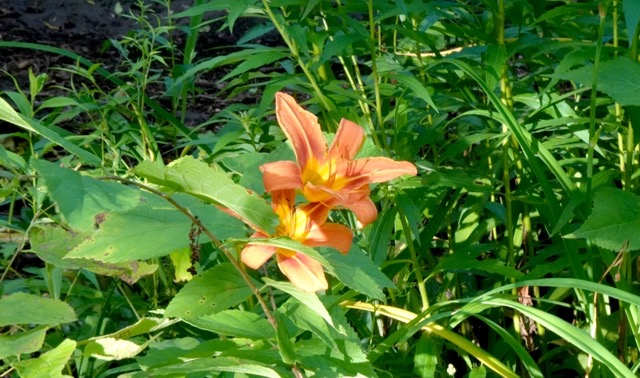
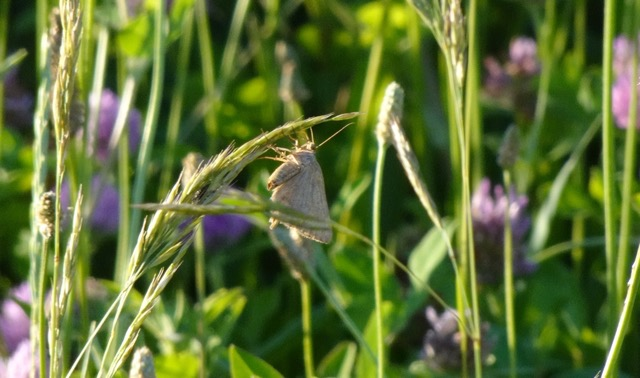
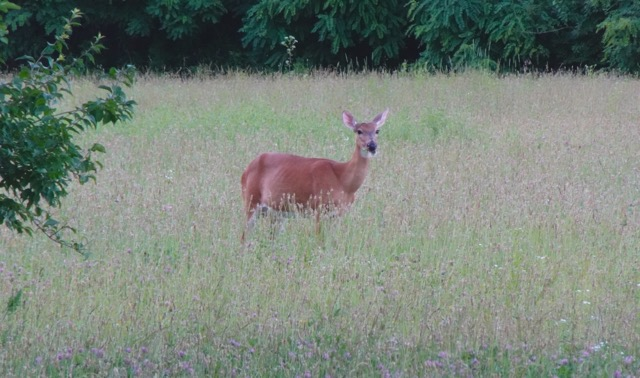
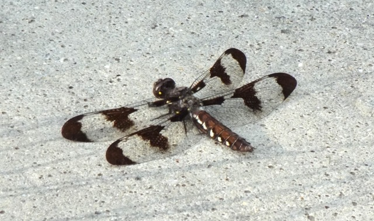
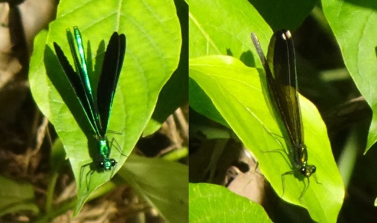
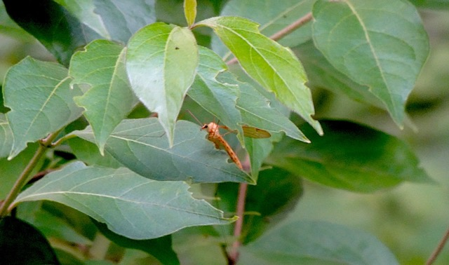

I'm very much interested in the forgotten game day parking lot in front of the Horticulture Park. Without lawn mowers, the field becomes overgrown and now filled with wildflowers in summer. What kind of wildflowers are they? Are they native or non-native? Where do they prefer to live? These are the questions I want to answer in this post. 

I learnt the word 'overgrown' when birding. I want to find dickcissels and bobolinks this summer, since they are typical Midwest summer birds. The field guide says 'look for overgrown fields or tallgrass prairies'. Without a car, it's hard to go to these places - there are no sidewalks in rural Indiana, and last time I tried biking north, I freaked myself out on the biking trail-less McCormick Rd crossings. So, I decide to try my luck on the game day parking lot. 

Unfortunately, this specific field may not be overgrown enough to fulfill a dickcissel's needs. Still quite beautiful, though; and it clearly fulfills a lot of other animals' needs -- I even saw a *Homo sapiens* use this space for a maternity photoshoot!

---

## Plants

Still working on IDing the exact species. It's surprising that most plants I've found are non-native. 

### Overgrown Parking Lot

#### Buttercups

{group='dft'}

- Non-native plant, native to Eurasia. Can be [toxic to grazing animals](https://extension.entm.purdue.edu/newsletters/pestandcrop/article/control-of-buttercups-in-indiana-fields/).
- Bright yellow blossoms. Though toxic to animals, still look beautiful. Found on field edges near McCormick Rd. 

#### Red Clover

{group='dft'}

- Non-native plant, native to Eurasia.
- Your everyday clover but a pink one, looking similar to the common white clovers when looking closely at its flower and leaves. Compared to white clovers and shamrocks, its leaves are more pointy. Found all over the field. 

#### Salsify

{group='dft'}

- Non-native plant, native to Eurasia.
- Looks like a giant dandelion, and is extremely tall - almost 1 meter. 
- Deer eat them. You can see that in this [picture](#white-tailed-deer). After searching on RedNote, I found that some people in Eastern China also eat them. 

#### Plantain & Fleabane

{group='dft'}

- **Ribwort Plantain**: non-native plant, native to Eurasia. Has some natural soothing properties. Its Chinese name '车前' means 'front of car', illustrating its ability to survive in harsh conditions.
- **Annual Fleabane**: native! Yeah! Common and beautiful small white flowers, looking like taller daisies. 

#### Queen Anne's Lace

{group='dft'}

- Non-native plant, native to Eurasia.
- Also known as wild carrot, like Salsify, can grow very high. This one is about 1 meter tall. 

### Horticulture Woods Trails

#### Orange Daylily

{group='dft'}

- Non-native plant, native to Asia.
- This kind of daylily grows near water. It's called 'daylily' because individual blossoms only last 24 hours. Its scientific name, *'Hemerocallis'*, means 'beauty for a day'.

## Animals

::: callout-warning
Close-ups of various kinds of insects.
:::

### Overgrown Parking Lot

#### Some kinda Moth

{group='dft'}

- Native?
- Moth are always harder to identify. This one is totally grey, and rests on the tip of some bromegrass/quackgrass species. 

#### White-tailed Deer

{group='dft'}

- Native.
- This one is a beautiful lady (?), walking gently from woods to the open grass at dusk, eating [salsify](#salsify) - you can see that flower head dangling near its mouth. Concerning diet, deer are more selective than grazing animals like cattle. They have some preferences and would not eat everything on this field. Read more on their diet in Indiana [here](https://www.in.gov/dnr/fish-and-wildlife/wildlife-resources/animals/white-tailed-deer-biology/).
- I once saw their traces on snow back in mid-December. It's a dreamy encounter, which reminds me of the music video of Newjeans's song *Ditto*.

### Horticulture Woods Trails

#### Common Whitetail

{group='dft'}

- Native dragonfly. 
- It has strikingly beautiful geometric patterns on its wings. I first saw it in Patterson Park in Baltimore, MD, at that time I thought its wings were like four sticks with eight rectangular fans - which is clearly not the case. It has a dotted white stripe on its side. 

#### Ebony Jewelwing

{group='dft'}

- Native damselfly. Damselfies (order *Zygoptera*) are smaller and slimmer compared to dragonflies, and unlike dragonflies, they hold their wings along the body when at rest. 
- Male jewelwings have iridescent blue body, wings look totally black at some directions; female jewelwings have iridescent brown body, with small white dots on their slightly transparent wings.
- A lot of them gather at the eastern trail entrance of the park. When interrupted, they fly up a little bit slowly, then fall back gracefully on the leaves, like small pieces of midnight. 

#### Fragile Forktail

{group='dft'}

- Native damselfly.
- Very very small (too small that this picture is out of focus) and delicate. Found near the eastern trail entrance, next to the stream, and it sits on the tip of a newly grown grape vine. 

#### Giant Ichneumon Wasp

{group='dft'}

- Native.
- Found deep in the trail, next to woods. Looks scary with its red body and massive ovipositor (looks like a 3-cm-long stinger), but harmless to humans. It lives a parasitoid lifestyle, inserting its ovipositor to the larva of horntail wasps to lay eggs, and its larva would feed on the hortail wasp larva. 

---

Actually, I was slightly sad knowing that most flowering species are non-native plants. Maybe nature preserves around me would have more native plants? Next time I'd try [Prophetstown SP](https://www.in.gov/dnr/state-parks/files/sp-Prophetstown_Wildflowers.pdf) and Celery Bog; Indiana Dunes NP, too, maybe. I should also sort out all the pictures I took when visiting them before.

I'm also currently reading [Chris Helzer](https://prairieecologist.com/about/)'s *the Ecology and Management of Prairies in the Central United States* to get some idea of this kind of ecosystem. Will share my thoughts when finished!
