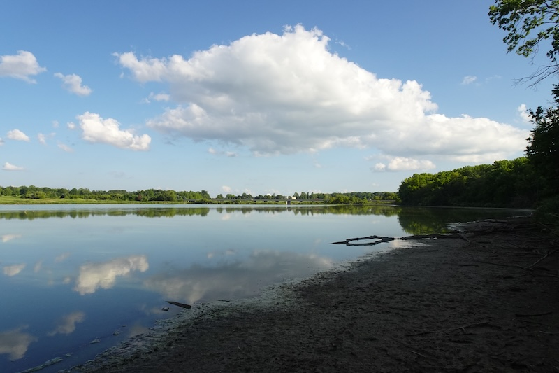
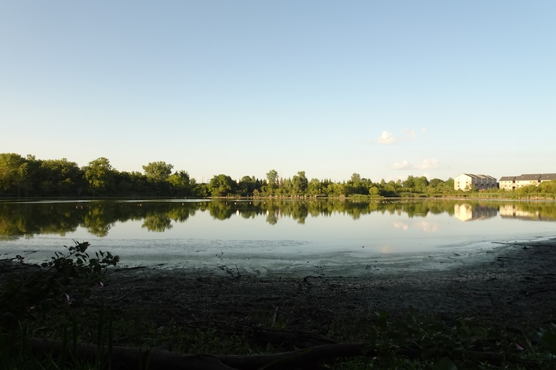
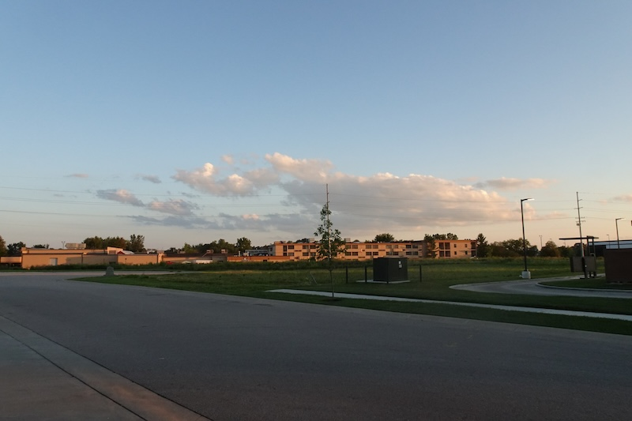
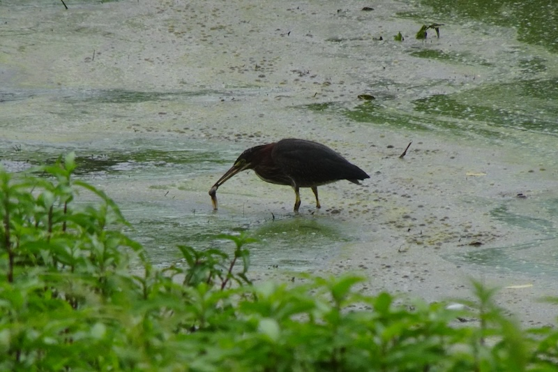
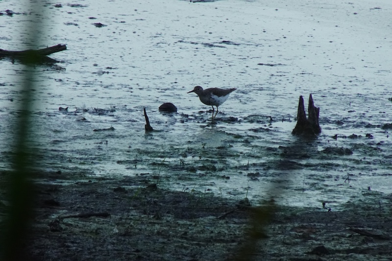
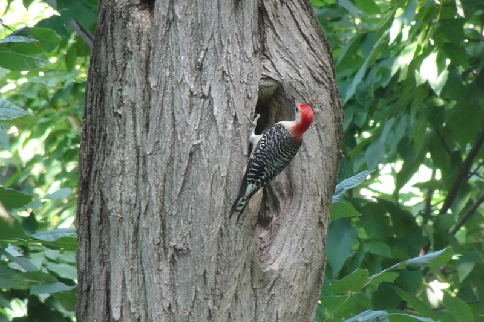
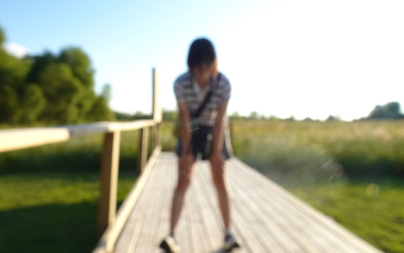

恍若隔世，大病一场感觉4月以及之前的回忆都黯淡了，触摸过去的自己觉得好陌生，以前的热爱和渴望都好陌生。不知道发生了什么…试图与自己重新熟悉起来…

最后一次能正常地去观鸟是在五月底六月初，当时在遗憾错过了四月底五月初的春迁。然后回忆就掐断了…现在在亲友的帮助下和现实再次建立了联结，发现鸟儿们都回来了…些许地难过

到底发生了什么，到底学到了什么，或许需要等待一个身体和精神都更加稳定的时刻再去探索吧。现在只有先告别。

## 最后的观鸟

男朋友来看我，在暴雨来临前去林子转了转，看见一只美洲绿鹭在泥滩上吃鱼。

一对spotted sandpiper贴着水面飞行，这一只比较大胆，我躲在芦苇丛后看它吃东西看了好久。

最后还是没有见到咱们的大明星东部鸣角鸮Ruby，好遗憾，但这个树洞也不是没有客人——这是来蹭饭的red-bellied woodpecker。

---

