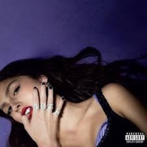
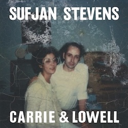
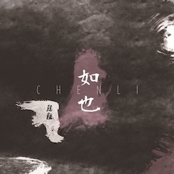
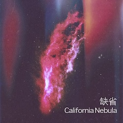
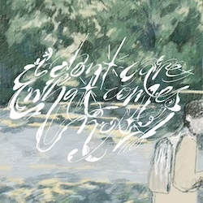
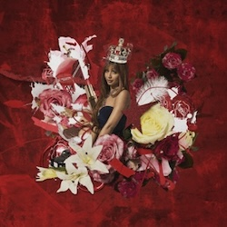
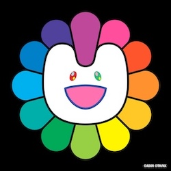
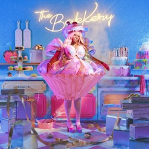
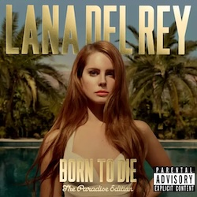

## 冬日电台

### 音乐与我的冬天

-   一月: 做了0件事。或许用黑豹的Don't Break My Heart泡别人算是一件事。

-   二月: 做了0件事。本来计划去看杯糕结果没去成。

-   三月: 刚刚开始，但因为春天来了我觉得一切都会好起来的——虽然做了0件事，但就这么相信着！

### 我的冬日专辑

#### [Olivia Rodrigo - GUTS (2023)](https://music.apple.com/us/album/guts/1694386825)

::: column-margin
{group="cover"}
:::

> *‘I forgive and I forget/I know my age and I act like it’*

想来一点不属于我的青少年勇气去面对崭新的感情生活。

虽然说“永远有人在年轻”——年轻人都喜欢用朋克来宣泄焦虑和愤怒，Patti如此，Avril如此——但每一代年轻人面对的世界和为之挣扎的困境都是不一样的，娅娅的这张专辑就是属于我们这个礼崩乐坏的后疫情时代的青少年朋克专辑。喜欢她在*all-american bitch*主歌里唱诗班般的吟唱和副歌里的疯狂嘶吼，也欣赏她即使感到挫败依然抱着一颗纯真之心的生活态度。娅娅就是2020s的摇滚明星。

并且她真的好幽默啊！！谁听到*bad idea right*能不笑……Yes I know that he's my ex, but can't two people reconnect? I only see him as a friend, the biggest lie I've ever said (狂笑

***推荐曲目：**all-american bitch/get him back!/bad idea right?/ballad of a homeschooled girl*

#### [Sufjan Stevens - Carrie & Lowell (2015)](https://music.apple.com/us/album/carrie-lowell/955572616)

::: column-margin
{group="cover"}
:::

> *‘Well, you do enough talk, my little hawk, why do you cry/Tell me, what did you learn from the Tillamook burn, or the Fourth of July'*

内心的一部分在哀悼一些对我而言无可挽回地改变了的事物。

Sufjan这张讲的是“失去一个既陌生又熟悉的人”——他的生母的去世，非常动人。给*Call Me By Your Name*的OST *Mystery of Love*也是同时期写的。这也是一张写俄勒冈的专辑，俄勒冈是我最喜欢的州。作者和我一样有无可救药的浪漫化地理区域的毛病。

***推荐曲目：**Should Have Known Better/Eugene/Fourth of July*

#### [陈粒 - 如也 (2015)](https://music.apple.com/ca/album/%E5%A6%82%E4%B9%9F/1413542639)

::: column-margin
{group="cover"}
:::

> *'你背对着山河一步步走向我/你脚踏着山河一步步走近我/你打开了我的躯壳/你唤醒了我的耳朵/带走我'*

陈粒女同时候。真的是用整个身体和灵魂在爱，歌声就像一桶冷水一样从脊背浇下去。

***推荐曲目：**祝星/奇妙能力歌*

---

## 春日电台

### 音乐与我的春天

-   四月: 做了0件事。一切都没有好起来，想去看Magdalena Bay但也失败了。

-   五月: 去看了两个音乐节！请看[这篇博文](../260525_review_sgf/index.qmd)。

-   六月: 做了0件事。

### 我的春日专辑

#### [缺省 - California Nebula (2017)](https://defaultplab.bandcamp.com/album/california-nebula)

::: column-margin
{group="cover"}
:::

> *‘愚梦不醒，逝者如川。情绪丢在光程千年外的星云。故事编造从未存在的灵魂。’ - bandcamp介绍*

就是很美。会让人想起北京的冬天吗？虽然我从未在北京度过冬天。玉米地的冬天还是太狂暴了，这张专辑的气质灰蒙蒙的。

***推荐曲目**：全专*

#### [sunshy - I don't care what comes next (2024)](https://sunshyily.bandcamp.com/album/i-dont-care-what-comes-next)

::: column-margin
{group="cover"}
:::

> *（一般不会给盯鞋专辑写歌词推荐）*

在芝加哥[Slide Away](../260525_review_sgf/index.qmd)上听的乐队！已经在那篇博文里倾情推荐过了。很好听，非常正统盯鞋非常清纯。

***推荐曲目：**시작/On the Train/Poison*

#### [PinkPantheress - Fancy That (2025)](https://music.apple.com/us/album/fancy-that/1806614239)

::: column-margin
{group="cover"}
:::

> *'Is this illegal? It feels illegal.'*

幻想自己在平行世界的都市生活的时候会听这张专，轻飘飘的！

***推荐曲目：**Illegal/Girl Like Me/Stateside*

---

## 夏日电台

### 音乐与我的夏天

-   七月: 做了0件事。

-   八月: 做了0件事。

-   九月: 做了0件事。或许九月末能看到Belle & Sebastian！

### 我的夏日专辑

#### [NewJeans - Supernatural (2024)](https://music.apple.com/us/album/supernatural-single/1750576829)

::: column-margin
{group="cover"}
:::

> *'Stormy night/Cloudy sky/In a moment you and I'*

Supernatural和上一张EP的How Sweet是我想学Hip-Hop的动力。归来吧牛腱子！

***推荐曲目**：全专*

#### [CupcakKe - The BakKery (2025)](https://music.apple.com/us/album/the-bakkery/1846990696)

::: column-margin
{group="cover"}
:::

> 'He gonna miss this face like when Trump got shot'

在成为我的guilty pleasure一年后杯糕大人的专辑成功成为我的哄睡专辑，传奇霍尼歌词和多变而劲爆的flow再次品鉴依旧令人拍案叫绝，此女水平了得。把性爱（和一切严肃的东西）解构得非常好笑，会笑萎的地步……谁和我玩角色扮演，我们来扮演杯糕和papi好吗！

Ballerina Coupe的beat其实和Supernatural有一丝相似之处（就像Ditto和Rich Baby Daddy有一丝相似之处），谁懂（。

***推荐曲目**：One of My Bedbugs Ate My Pussy/Ballerina Coupe/Fist Me*

#### [Lana Del Rey - Born to Die: The Paradise Edition (2012)](https://music.apple.com/us/album/born-to-die-paradise-edition-special-version/1442452465)

::: column-margin
{group="cover"}
:::

> 'I tell you all the time, Heaven is a place on Earth with you/Tell me all the things you wanna do/I heard that you like the bad girls, honey, is that true?
>
> It's better than I ever even knew/They say that the world was built for two/Only worth living if somebody is loving you/And, baby, now you do'

当了半年异性恋后我彻彻底底领悟了打雷姐的精髓。Video Games听得我柔肠寸断，雄心壮志尽失，只想沉醉在对方的眼神里；行走在世界上就觉得世界变得波光粼粼，身在悬崖上俯身下去看到的也不是黑洞而是温柔的海浪。老天啊，这就是*Heaven is a place on earth with you... only worth living if somebody is loving you...*

***推荐曲目**：Video Games/National Anthem/Ride/Cola/Gods & Monsters*
