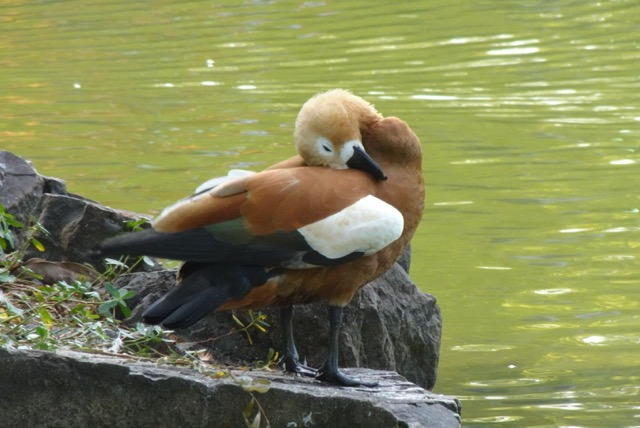
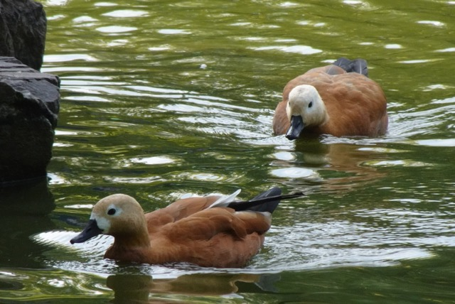
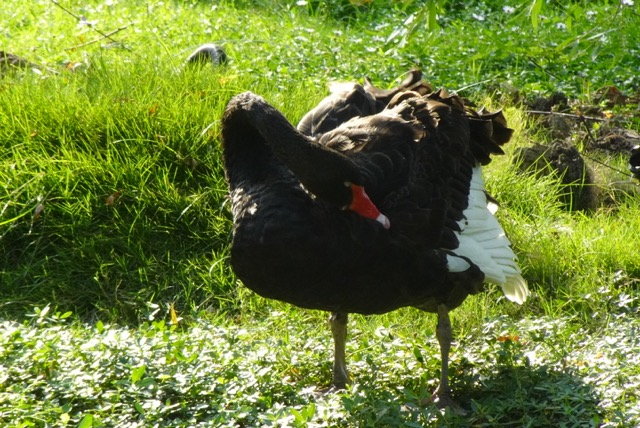
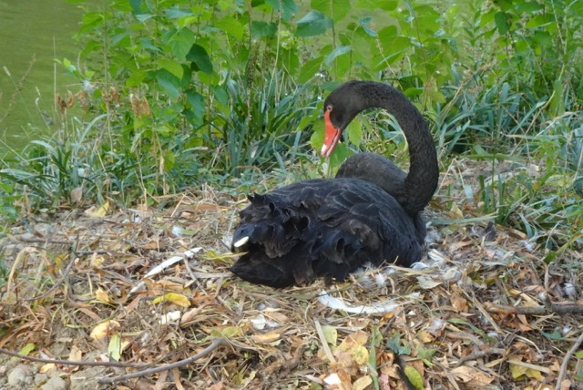
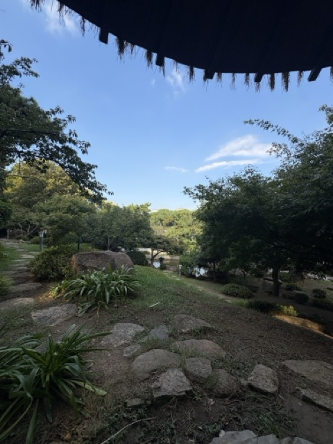
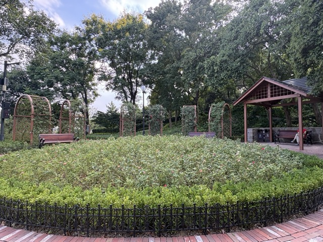

上个周末去了东园，还挺有意思的，简单记录一下。

位于姑苏区的东园靠近耦园/相门，以前是苏州动物园，近几年改造后接入了环城步道，拆除了围墙，建了很多游乐设施，遂成了周围居民放松遛娃的好去处。当然，对于鸟人来说，这里最有名的还是池子里的那一群赤麻鸭。

乘地铁去东园需要稍微走一会儿：1号线相门站下车，沿着护城河向北走，穿过仁恒仓街和耦园就到了，要走20-30分钟左右。沿河的风景都不错，若是有雅兴，也可以去坐坐游船。

## 观鸟

走到东园，果然一眼就看到了漂浮在池子上的大可颂。赤麻鸭很可爱，长着一双呆萌的豆豆眼，羽毛是刚出炉小面包一般完美的暖棕黄，弯着脖子洗澡时可以看到绿色的翼镜——是那种天鹅绒钢琴罩子一般的、带着光泽的墨绿色。鸭腿粗粗的，一看就很有劲。公鸭脖子上有一圈黑色的纹路，母鸭没有。上一次看到赤麻鸭还是在拉萨布达拉宫后面的宗角禄康公园，没想到居然可以在东南沿海看到，端着相机拍了好久。

::: photo-row
{group="grp"}

{group="grp"}
:::

水池里不可或缺的还有中国特色归化大鸟——黑天鹅。可能因为见过了美洲白鹈鹕（翼展2.4-2.9米）这种真正的巨鸟，现在看黑天鹅（翼展1.6-2米）都觉得就一点点小，不过他们的战斗力还是不可小觑。我们观察了一只在耐心洗澡的黑天鹅，它洗得非常认真，堪比拿着丝瓜瓢的搓澡大娘，每根羽毛至少用喙搓了三四遍。搓得告一段落了，它会呼啦啦扇翅膀抖干水，露出掩藏在翼下的白色羽毛——然后伸出长脖子舀起下一波水，把整个流程重复一遍。东园西边还给这些水鸟做了一个生态浮岛，我们看见一只黑天鹅蹲坐在一个大巢上孵蛋，旁边都是跳来跳去的麻雀。不知道天鹅觉不觉得吵。

::: photo-row
{group="grp"}

{group="grp"}

:::

## 游园

东园里有不少友情纪念建筑，基本都是上世纪90年代的遗留。苏州最有名的是园林，所以友好城市大多都是世界上著名的园林城市。苏州和日本的金泽是友好城市，这里就建了一个日本花园，颇有些京都御苑的神韵，枫树、松树、草亭、小桥一应俱全；就是树枝需要修修了，长得过于自由，没了型。幽默的是本来应该是枯山水（白沙）的地方浇上了白色混凝土，可能是方便管理吧；凉亭里放着分类垃圾桶，这也非常中国特色。

从日本花园向北走，能看到一个小小的西式花园，这是象征和美国“玫瑰城”波特兰友谊的玫瑰园（波特兰也有一个日本花园，不知道它的日本朋友是哪座城呢？）。不仔细看的话，其实很容易把玫瑰园当成一个普通的小花园，因为这种仿美式的花园在各地的古早游乐园里遍地都是——应该是迪士尼的影响吧？翠绿的玫瑰藤爬满了围成一圈的拱形花架，中间的圆形花圃里种着低矮的月季，已是初秋，花园一片翠色，花已经不多了。我在LA的Getty Center也看到过类似排列的花架，不过花卉的配置上就豪华多了，数不清的华美的玫瑰、铁线莲、虞美人和多肉植物，人往里面一站，就和仙境里的小精灵一样。看来花园要出效果，还是得堆钱呀。但这也没什么好苛责的，毕竟纽约大都会博物馆里花大功夫请苏州工匠飞过去搭建的、仿网师园的“明轩”，在苏州也不过就是个小酒店花园的水平。建筑呢，当然还是得去当地看才好看。

::: photo-row
{group="grp"}

{group="grp"}
:::
