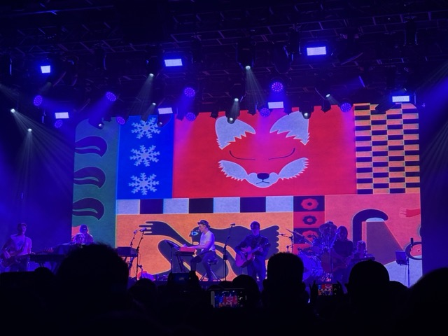
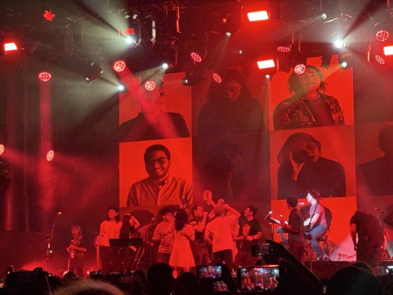

9月末，随着精神状态的稳定，我开始找工作。找工作这件事就和其他事一样，最讨厌的就是万事都没个定论的时候，所以也是三天打鱼两天晒网，干得十分烦闷。就在想，要不去上海看Belle & Sebastian吧！现在发现这是最近做得最好的决定，因为演出实在太棒啦。

回国以后听了很多国摇，印象深刻的有鼠鼠鼠和ybs!，和浣熊老师交流的时候她说这就是Twee-pop，一种以可爱、清新为印象的音乐流派，还说她和现在的乐队结缘就是因为B&S。脖子老师在演出前两天给我看了她做的无料，是*Fox in the snow*主题的流麻，果然很可爱！于是带着放松的心情搭上了去上海的火车。演出场地在徐汇滨江的瓦肆est，是个和The Anthem差不多大的大场，环境还不错。我们卡点到的，前面已经挤满了人。

演出[歌单](https://www.setlist.fm/setlist/belle-and-sebastian/2026/vas-est-shanghai-china-3b734400.html)包含两个部分，先是*If You're Feeling Sinister*全专（今年正好是这张专辑的30岁生日），然后是一些金曲合集。B&S的歌都非常好听，现场表演更是让魅力翻倍。曲调轻松又充满活力，歌词幽默而抚慰人心，因为是周年演出，所以人员配置和配器也堪称豪华。乐手们都是多面手！*Fox in the snow*的前奏钢琴简直美极了，随着歌曲的演进加入了原声吉他和小提琴，可以想像轻柔的初雪飘飘悠悠落到格拉斯哥街头的场景。*Get Me Away from Here, I'm Dying*的曲调极具感染力，演出结束和浣熊老师一起坐车的时候还情不自禁在哼唱…主唱说“一般都说B&S的音乐不能跟着跳舞啦，但这首歌你们可以跟着跳，虽然这是一首悲伤的歌”。于是从头跳到了尾——我其实也不会跳舞，所谓的跳舞就是原地扭秧歌+在两只脚之间更换重心，但还是好开心。当场听了喜欢上的歌还有*Mayfly*和*Judy and the Dream of Horses*。

音乐之外让我印象深刻的，一个是精美的visual——前半场IYFS的visual简直就像电影一样美丽——另一个就是主唱。主唱的嗓子简直保养得太好了，非常迷人，和吉他手的和声更是天籁。舞台魅力也是绝了，是那种很学生气、很有亲和力的魅力。中文营业简直是信手拈来，玩笑话不断（“我们真是花了很长时间才从格拉斯哥走到这里——不过你们更想看到30年前年轻又漂亮的我们吧——”、“你们去了格拉斯哥的Barrowland？看的哪一支乐队呀？Primal Scream？我就知道，因为Primal Scream每周都在那演（迅速唱了一段My life shines on🎵）”），fan service给足，并且非常会调动全场气氛。

演到*The Boy with the Arab Strap*的时候，第一排的观众被邀请上台跳舞，大家的脸上写满了惊喜和不可思议，握着手转圈蹦跳，真好啊！还有穿着苏格兰足球队队服的一家人也被邀请上了台，妈妈看起来激动又开心，小女孩抱着小熊懵懵的。主唱在歌曲间奏挨个夸了台上每个人的滚T，我和浣熊老师惊喜地发现有个人穿的正是鼠鼠鼠致敬Sonic Youth *Dirty*的T恤！主唱看到先是说“Sonic Youth”，又迅速纠正了自己，“哦，是Sonic Mouse，哇好可爱”，真是让人心儿暖暖的……在依次介绍完乐队成员后，主唱摘下了他的礼帽，鞠躬向大家致意，唱道“that makes me... the boy with the Arab Strap”，我在心里想，这真是完美的一夜啊……正如主唱所说，B&S真是make people happy的乐队。真想一直这样幸福下去。
