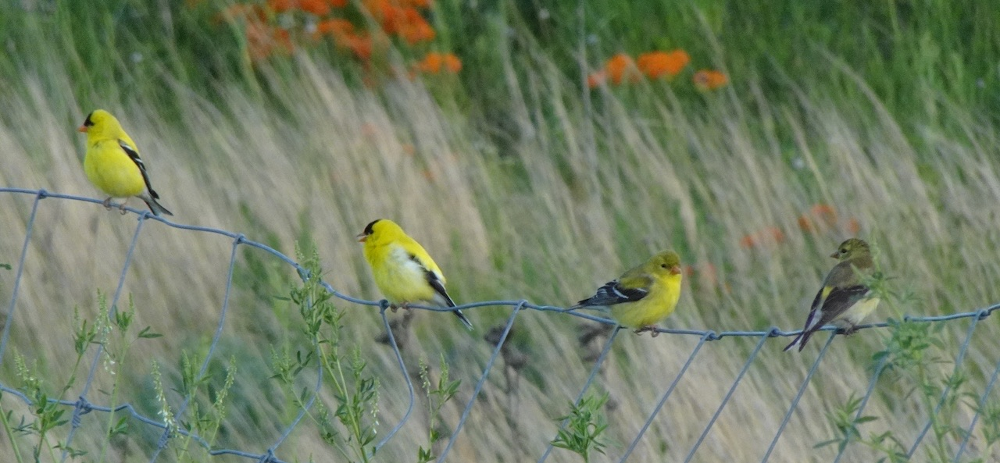

## Introduction

**I love birding!** Welcome to my personal birding records. I'm a casual birder who enjoys watching the most common birds in daily life (but also appreciate a trip to the wilds!).

You can see birds I've sighted at [bird list](#birdlist) (including an [interactive map](#map)) and all my favorite birding destinations at [places I went for birding](#places). [Links and resources](#links) are also provided. 

Besides this megapost, I sometimes also write separate [posts](../../archive.qmd#category=birding) about birding trips I went to. 

You can also check my [eBird profile](https://ebird.org/profile/NTk5NDQ1OQ). 

***Note**: Only wild birds were recorded. All photos taken by me (most with Sony WX800). All pixel arts created by me.*

::: callout-note
The next bird I want to see is: 

- ***Eastern Screech-Owl***, Ruby, I heard that you reside in a dead tree near the Celery Bog Natural Center, let me find you! 

- ***Wood Duck***, Oh the American Yuan-yang...
:::

------------------------------------------------------------------------

## Bird List

### My Bird List {#birdlist}

```{r bird list, echo = FALSE, message = FALSE, warning = FALSE}
library(tidyverse)
library(knitr)
library(DT)

# theme
pekosz_theme <- theme_minimal() +
  theme(
    plot.title = element_text(hjust = 0.5, face = 'bold'),
    axis.line = element_line(size = 0.5),
    axis.ticks = element_line(),
    legend.title = element_text(face = 'bold'),
    panel.grid.major = element_blank(),
    panel.grid.minor = element_blank(),
    axis.text.x = element_text(angle = 90, vjust = 0.5, hjust=1),
    rect = element_rect(fill = "transparent")
  )
theme_set(pekosz_theme)


# list
bird_list <- read.csv("bird_df.csv", fileEncoding = "UTF-8")

kable(
  bird_list[, c(1,2,3,4,5,6)],
  col.names = gsub("[.]", " ", names(bird_list)[c(1,2,3,4,5,6)])
)
```

### Summary & Milestones

```{r results = FALSE, echo = FALSE, warning = FALSE}

# summary location
result <- as.data.frame(
  table(unlist(strsplit(bird_list$location, ",\\s*")))
)

colnames(result) <- c("location", "count")
result
```

Now I've observed <code>`r nrow(bird_list)`</code> bird species, in which <code>`r result$count[result$location == "US"]`</code> of them were spotted in the United States.

```{r time, echo = FALSE, message = FALSE, warning = FALSE}
library(lubridate)

lifer <- read.csv("lifer_df.csv", fileEncoding = "UTF-8")

lifer <- lifer %>%
  mutate(date = mdy(date))

ggplot(lifer, aes(x = date, y = lifer)) + 
  geom_line() +
  labs(title = 'Lifers by Time')
```

- **100 bird species spotted**: June 2025

- **125 bird species spotted**: Oct 2025

- **150 bird species spotted**: Jan 2026

- **175 bird species spotted**: May 2026

The bird family of most lifers for me is currently <code>Waterfowl</code>.

```{r barplot, echo = FALSE, message = FALSE, warning = FALSE}
ggplot(bird_list, aes(x = fct_infreq(Family))) + 
  geom_bar(aes(fill = after_stat(count))) +
  theme(
    axis.text.x = element_text(angle = 90, hjust = 1),
    axis.ticks.x = element_blank(),
    legend.position = "none"
  ) +
  labs(x = "Family", y = "Count", title = 'Lifers by Family')
```

### Birding Around the World: Interactive Map {#map}

*Click on the map to see pictures of birds! Urban sites marked in pink while rural sites marked in green.*

```{r map, echo = FALSE, message = FALSE, warning = FALSE}
library(leaflet)
library(htmltools)

# Read the CSV file
bird_markers <- read.csv("bird_markers.csv", stringsAsFactors = FALSE)

# Separate rural and urban markers
rural <- subset(bird_markers, type == "rural")
urban <- subset(bird_markers, type == "urban")

# Customize pop-up
popup_css <- tags$style(HTML("
  .leaflet-popup-content-wrapper {
    background: rgba(255, 255, 255, 0.5);
    box-shadow: 0 0 15px rgba(0, 0, 0, 0.5);
    border-radius: 10px;
    text-align: center;
    padding: 3px;
  }
  .leaflet-popup-tip {
    background: rgba(255, 255, 255, 0.7);
  }
  .leaflet-popup-content {
    font-family: sans-serif;
    line-height: 1.1;
    white-space: pre-wrap;
  }
"))

# Create the map with custom-styled popups
leaflet() %>%
  addTiles() %>%
  addCircleMarkers(data = rural, 
                   lng = ~lng, lat = ~lat, 
                   popup = ~popup, 
                   color = 'green', 
stroke = TRUE, fillColor = 'white',
fillOpacity = 1, radius = 5) %>%
  addCircleMarkers(data = urban, 
                   lng = ~lng, lat = ~lat, 
                   popup = ~popup, 
                   color = "pink", 
stroke = TRUE, fillColor = 'white',
fillOpacity = 1, radius = 5) %>%
  # Add custom CSS to the map
  addControl(html = popup_css, position = "topleft") # %>%
  # addProviderTiles(providers$Stadia.Outdoors)
```

------------------------------------------------------------------------

## Places I Went For Birding {#places}

*For 'Birds', I only record the bird species I've seen. For a full list of potential birds, please see ebird and other reference.*

### Midwest, USA

#### 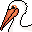 West Lafayette, IN: Celery Bog

::: column-margin
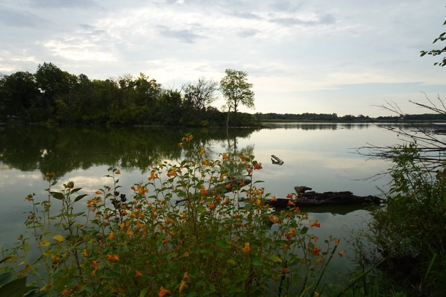{group="landspics"}
:::

-   **Type**: Rural \| Wetlands (freshwater)
-   **First Visited**: Sep 2025
-   **Last Visited**: Mar 2026
-   **Birds**: Mallard, American Goldfinch, Red-tailed Hawk, Killdeer, Northern Cardinal, Double-crested Cormorant, Song Sparrow, Red-bellied Woodpecker, Tennessee Warbler, Belted Kingfisher, Great Blue Heron, Yellow-rumped Warbler, Northern Flicker, Pileated Woodpecker, Hairy Woodpecker, American Robin, White-breasted Nuthatch, Eastern Phoebe, Cooper's Hawk, Dark-eyed Junco, Brown Creeper, Mourning Dove, Canada Goose, Red-winged Blackbird, Brown-headed Cowbird, American Tree Sparrow
-   **Comments**: Beautiful and peaceful place, one of the best birding destinations in West Lafayette. Staff at the natural center are very friendly. It's home to several raptors, and you can also watch blue herons catching fish. I often start walking at Cherry Ln, and ends the trail at Walmart supercenter to take CityBus #21 back home, which would typically take 2-3 hours. 
-   **Link**: [ebird](https://ebird.org/hotspot/L445373)
-   **Related Posts**: [Mar '26 Spring Migration](../260326_birding_celerybog/index.qmd)

#### 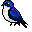 West Lafayette, IN: Celery Bog - North Pond

::: column-margin
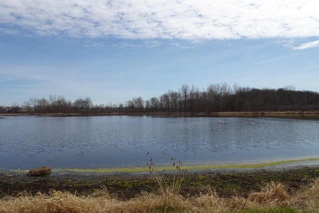{group="landspics"}
:::

-   **Type**: Rural \| Wetlands (freshwater)
-   **First Visited**: Apr 2025
-   **Last Visited**: Mar 2026
-   **Birds**: American White Pelican, Mallard, Greater Yellowlegs, Great Blue Heron, Canada Goose, Eastern Bluebird, Tree Swallow, Ruddy Duck, Northern Pintail, Bufflehead, Red-Shouldered Hawk
-   **Comments**: Regional migration trap, a great place to see shorebirds and ducks. 
-   **Link**: [ebird](https://ebird.org/region/L30081358)

#### 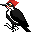 West Lafayette, IN: Horticulture Park

::: column-margin
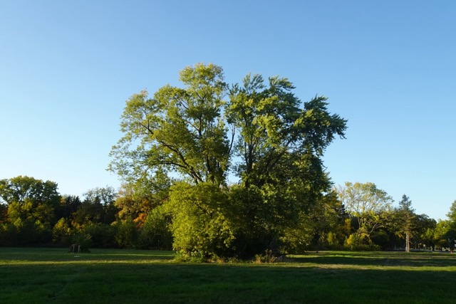{group="landspics"}
:::

-   **Type**: Rural \| Woods (freshwater)
-   **First Visited**: Sep 2025
-   **Last Visited**: June 2026
-   **Birds**: American Robin, Red-winged Blackbird, Eastern Bluebird, Chipping Sparrow, White-throated Sparrow, European Starling, Northern Cardinal, Northern Flicker, Hairy Woodpecker, Downy Woodpecker, Pileated Woodpecker, Red-bellied Woodpecker, Tufted Titmouse, Killdeer, White-breasted Nuthatch, American Crow, Blue Jay, Great Blue Heron, Turkey Vulture, Eastern Wood-Pewee, Blue-gray Gnatcatcher, Northern House Wren, House Finch, American Goldfinch, Baltimore Oriole, Brown-headed Cowbird, American Redstart, Northern Parula, Mallard, Mourning Dove, Eastern Phoebe, Eastern Warbling Vireo, Carolina Wren, Gray Catbird, House Sparrow, Chipping Sparrow, Song Sparrow, Indigo Bunting, Double-crested Cormorant, Carolina Chickadee, Cedar Waxwing, Common Nighthawk, Barn Swallow, White-eyed Vireo, Yellow-throated Warbler
-   **Comments**: Nice trail. 'My patch' - kind of. A large flock of robins and starlings rest on the trees near the open grass edge, and you can find jays and woodpeckers in the trails through the woods. During spring migration, a lot of songbirds rest and sing on trees near the woods edges. Indigo buntings nest here. 
-   **Link**: [ebird](https://ebird.org/region/L457935)
-   **Related Posts**: [May '26 Songbirds](../260521_birding_horticulture/index.qmd)

#### 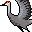 Pulaski, IN: Jasper-Pulaski Fish & Wildlife Area

::: column-margin
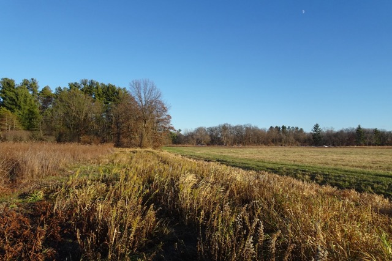{group="landspics"}
:::

-   **Type**: Rural \| Grasslands
-   **First Visited**: Nov 2025
-   **Last Visited**: Nov 2025
-   **Birds**: Sandhill Crane, Red-bellied Woodpecker
-   **Comments**: Dreamy and Beautiful at sunset.
-   **Link**: [IN.gov DNR](https://www.in.gov/dnr/fish-and-wildlife/properties/jasper-pulaski-fwa/sandhill-cranes/) \| [ebird](https://ebird.org/hotspot/L1004877)

#### 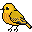 Porter, IN: Indiana Dunes National Park

::: column-margin
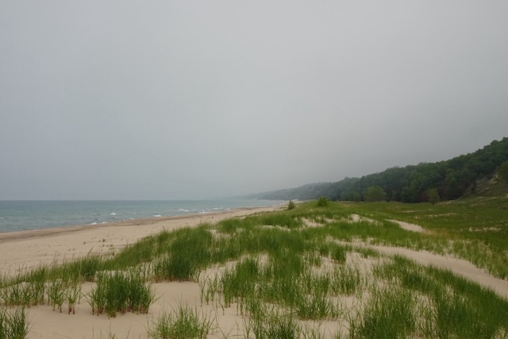{group="landspics"}
:::

-   **Type**: Rural \| Wetlands (freshwater); Open water (freshwater)
-   **First Visited**: May 2026
-   **Last Visited**: May 2026
-   **Birds**: Canada Goose, Mute Swan, Killdeer, Ring-billed Gull, Caspian Tern, Double-crested Cormorant, Great Egret, Great Blue Heron, Turkey Vulture, Belted Kingfisher, Great Crested Flycatcher, Red-eyed Vireo, Blue Jay, Northern Rough-winged Swallow, Barn Swallow, Gray Catbird, American Robin, House Sparrow, Eastern Towhee, Baltimore Oriole, Red-winged Blackbird, Common Grackle, Common Yellowthroat, Northern Yellow Warbler, Summer Tanager
-   **Comments**: A much bigger celery bog. The [Cowles Bog trail](https://www.nps.gov/indu/planyourvisit/cb16.htm) takes a good amount of walk to complete but biodiversity is great. Only regret is not seeing any gallinule or sora. Loads of caspian terns flying on the Michigan Lake shores. 
-   **Link**: [National Park Service](https://www.nps.gov/indu/index.htm) \| [ebird (Cowles Bog)](https://ebird.org/hotspot/L152744)

####  Chicago, IL: Northerly Islands

::: column-margin
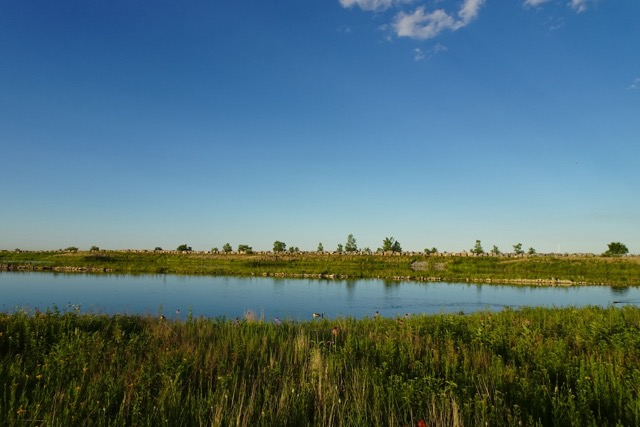{group="landspics"}
:::

-   **Type**: Rural \| Grasslands; Wetlands (freshwater); Open water (freshwater)
-   **First Visited**: June 2026
-   **Last Visited**: June 2026
-   **Birds**: Canada Goose, Mallard, Killdeer, Spotted Sandpiper, Ring-billed Gull, Caspian Tern, Double-crested Cormorant, Northern Rough-winged Swallow, Barn Swallow, Cliff Swallow, American Robin, American Goldfinch, Savannah Sparrow, Red-winged Blackbirds, Northern Yellow Warbler, Dickcissel
-   **Comments**: Sat next to Lake Michigan and Chicago downtown, Northerly Islands provide various environments for birds to live, including grasslands full of native plants and wetlands - making it perfect for grassland birds like savannah sparrows and dickcissels. Trails are a bit rugged and usually takes ~2 hours to finish. 
-   **Link**: [ebird](https://ebird.org/hotspot/L294426)

### East Coast, USA

####  Baltimore, MD: Inner Harbor

::: column-margin
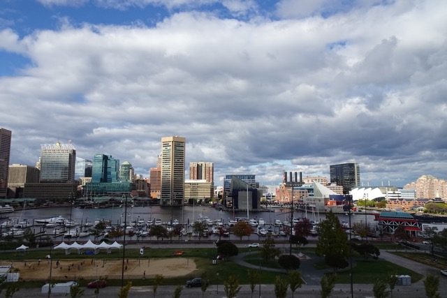{group="landspics"}
:::

-   **Type**: Urban \| Harbor (brackish water)
-   **First Visited**: Aug 2023
-   **Last Visited**: Apr 2025
-   **Birds**: Canada Goose, Double-crested Cormorant, Laughing Gull, Mallard, Ring-billed Gull, Rock Pigeon, Osprey, Northern Rough-winged Swallow, Fish Crow, Black-crowned Night Heron, Least Tern
-   **Comments**: From inner harbor to harbor east and locust point, the waterfront of downtown Baltimore is a great place to watch gulls & various kinds of waterfowls. A large flock of gulls rest in front of the harbors near Whole Foods from late fall to early spring in the evening. Check out the Harbor Connector water taxi - you can see gulls and cormorants flying across the harbor.
-   **Link**: [Harbor Connector Water Taxi (free to ride!)](https://www.baltimorewatertaxi.com/lines) \| [ebird](https://ebird.org/region/L745089)

#### 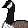 Baltimore, MD: Patterson Park

::: column-margin
{group="landspics"}
:::

-   **Type**: Urban \| Wetlands (freshwater)
-   **First Visited**: Mar 2025
-   **Last Visited**: May 2025
-   **Birds**: American Robin, Canada Goose, Mallard, Rock Pigeon, Fish Crow, House Finch, Red-winged Black Bird, Green Heron, House Sparrow, Blue Jay, Mourning Dove
-   **Comments**: The historical park is a great place for birdwatching. If you visit the park at late spring, you can watch flocks of robins, sparrows and blackbirds singing, mallards hanging out, and Canada geese raising their goslings around the pond! They're not afraid of people and happy to interact with visitors.
-   **Link**: [Friends of Patterson Park](https://pattersonpark.com/#visit-us) \| [ebird](https://ebird.org/hotspot/L449982)

#### 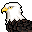 Cambridge, MD: Blackwater National Wildlife Refuge

::: column-margin
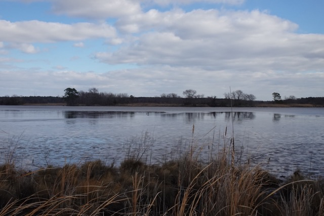{group="landspics"}
:::

-   **Type**: Rural \| Wetlands (brackish water)
-   **First Visited**: Jan 2025
-   **Last Visited**: Apr 2025
-   **Birds**: Bald Eagle, Canada Goose, Carolina Wren, Downy Woodpecker, Great Blue Heron, Hermit Thrush, Hooded Merganser, Killdeer, Mallard, Northern Cardinal, Northern Mockingbird, Ring-billed Gull, Turkey Vulture, Whistling Swan, Wilson's Snipe, Osprey, Red-winged blackbird, Chipping Sparrow, Blue Jay, Tufted Titmouse, Tree Swallow, Lesser Yellowlegs, Dunlin, Least Tern, Least Sandpiper, Great Egret
-   **Comments**: A perfect place for birding at the east coast of Chesapeake Bay, the most iconic bird being bald eagle. With woods, trails, wetlands and ponds around the wildlife drive, you can see a variety of birds here. Also, the visitor center's pick of merchandises is superb.
-   **Links**: [Friends of Blackwater](https://friendsofblackwater.org/) *check the webcams* \| [U.S. Fish & Wildlife Service: Blackwater National Wildlife Refuge](https://www.fws.gov/refuge/blackwater) \| [ebird](https://ebird.org/region/L598944)

#### 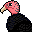 Harpers Ferry, WV: Maryland Heights

::: column-margin
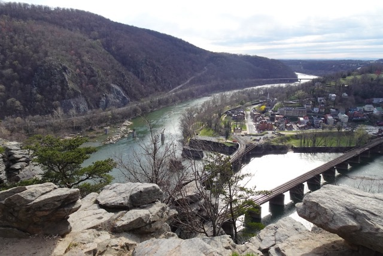{group="landspics"}
:::

-   **Type**: Rural \| Woods; Stream/River (freshwater)
-   **First Visited**: Mar 2024
-   **Last Visited**: Mar 2024
-   **Birds**: Canada Goose, Mallard, Great Blue Heron, Turkey Vulture
-   **Comments**: The streams in the woods are a good place to catch up with our geese and heron friends.
-   **Link**: [National Park Service: Harpers Ferry](https://www.nps.gov/hafe/index.htm) \| [ebird](https://ebird.org/region/L715042)

#### 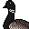 New York, NY/Hudson, NJ: Liberty Island/Liberty State Park

::: column-margin
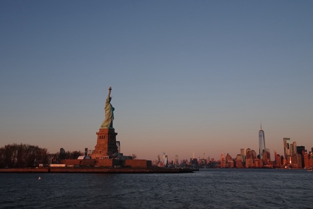{group="landspics"}
:::

-   **Type**: Urban \| Wetlands (brackish water); Open water (brackish water)
-   **First Visited**: Jan 2024
-   **Last Visited**: May 2026
-   **Birds**: American Herring Gull, Brant, European Starling, Ring-billed Gull, Laughing Gull, Boat-tailed Grackle, American Black Duck, Double-Crested Cormorant, Red-winged Blackbird, Song Sparrow
-   **Comments**: While New York City resides mainly pigeons, the Liberty Island is surprisingly good places to watch waterfowls, and of course, gulls. Just mind your food, the gulls are really aggressive. The nearby Liberty SP has a tidal marsh named Richard J Sullivan Natural area, which is home to various ducks and wetland birds. 
-   **Link**: [ebird (Liberty Island)](https://ebird.org/region/L2686238)\| [ebird (Liberty SP)](https://ebird.org/region/L189035)\| [Liberty State Park - NJ Dept. of Environmental Protection](https://dep.nj.gov/parksandforests/state-park/liberty-state-park/)

### The South, USA

####  Durham, NC: Duke University

::: column-margin
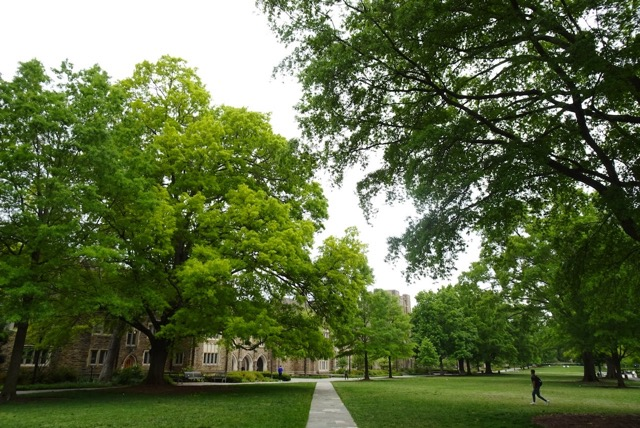{group="landspics"}
:::

-   **Type**: Rural \| Woods
-   **First Visited**: Jan 2022
-   **Last Visited**: Jan 2024
-   **Birds**: Red-tailed Hawk, Northern Cardinal, Eastern Bluebird, Carolina Chickadee, American Robin, Carolina Wren, House Finch, Ruby-crowned Kinglet, White-breasted Nuthatch
-   **Comments**: With birdfeeders everywhere, the Sarah P. Duke Garden is a great place for backyard birds like northern cardinal and eastern bluebird. I saw a red-tailed hawk with its nest near the old chemistry building. There are also some exotic waterfowls in the ponds of Duke Garden, like mandarin ducks & ruddy shelducks, you can check the link below.
-   **Links**: [Exotic Waterfowls in Duke Garden](https://www.dpughphoto.com/duke_gardens_exotic_ducks.htm) \| [Duke Gardens](https://gardens.duke.edu/) \| [ebird](https://ebird.org/region/L4754196)

#### 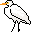 New Orleans, LA: Maurepas Swamp

::: column-margin
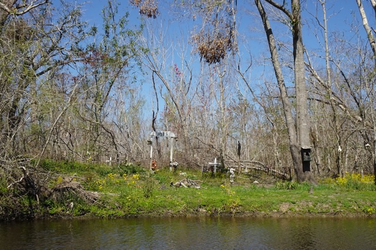{group="landspics"}
:::

-   **Type**: Rural \| Wetlands (freshwater)
-   **First Visited**: Mar 2022
-   **Last Visited**: Mar 2022
-   **Birds**: Great Egret
-   **Comments**: Went there as a part of swamp tour, feeding alligators and raccoons with marshmallows etc.
-   **Link**: [Louisiana Dpt. of Wildlife & Fisheries: Maurepas Swamp](https://www.wlf.louisiana.gov/page/maurepas-swamp) \| [ebird](https://ebird.org/hotspot/L692377)

### West Coast, USA

#### 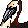 Los Angeles, CA: Malibu Lagoon

::: column-margin
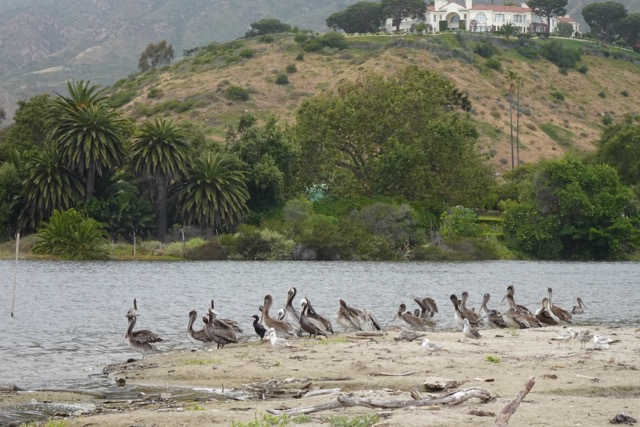{group="landspics"}
:::

-   **Type**: Rural \| Wetlands (freshwater); Open water (saline water)
-   **First Visited**: June 2025
-   **Last Visited**: June 2025
-   **Birds**: Common Raven, Red-breasted Merganser, Great-tailed Grackle, Snowy Egret, Black Phoebe, Gadwall, Western Gull, Canadian Goose, Brant, Mallard, Brown Pelican, Double-Crested Cormorant
-   **Comments**: Famous for surfing but the lagoon has striking biodiversity. Mixed groups of brown pelicans and double-crested cormorants fishing in the lagoon.
-   **Link**: [California State Parks: Malibu Lagoon State Beach](https://www.parks.ca.gov/?page_id=835) \| [eBird](https://ebird.org/region/L597658)

####  Seattle, WA: Discovery Park

::: column-margin
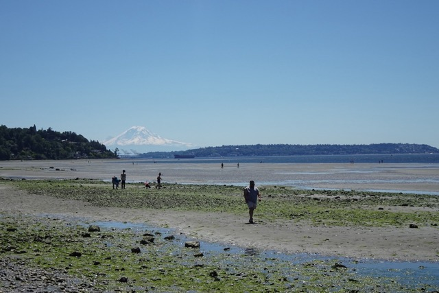{group="landspics"}
:::

-   **Type**: Rural \| Woods; Open water (saline water)
-   **First Visited**: July 2024
-   **Last Visited**: July 2024
-   **Birds**: Caspian Tern, Glaucous-winged Gull, Great Blue Heron, American Crow
-   **Comments**: With all its natural beauty, the discovery park is a great place to enjoy the views of volcano, forests and sea at once - and of course, gulls.
-   **Link**: [Seattle.gov: Discovery Park](https://www.seattle.gov/parks/allparks/discovery-park) \| [ebird](https://ebird.org/region/L128530)

####  Cannon Beach, OR: Haystack Rock

::: column-margin
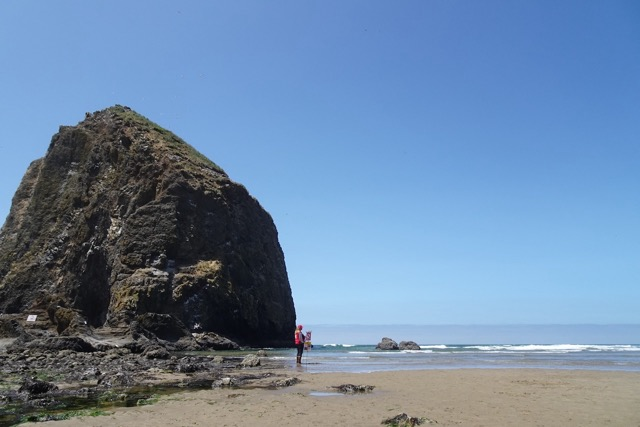{group="landspics"}
:::

-   **Type**: Rural \| Sea stack; Open water (saline water)
-   **First Visited**: July 2024
-   **Last Visited**: July 2024
-   **Birds**: Brown Pelican, California Gull, Tufted Puffin, Common Murre, Brandt's Cormorant, American Crow
-   **Comments**: It's just heaven if you love seabirds and shorebirds - in summer, various birds are nesting on the cliff of haystack rock. Remember to bring your binoculars since there's a sign saying 'birds only beyond this point' - you would not be able to get too close to that rock. The volunteer is very friendly and helpful, and tide pools are also great fun to explore. Also, if you reside in Portland, be sure to check out Powell's books, it has a great collection of field guides as well as other gems.
-   **Links**: [Friends of Haystack Rock](https://www.friendsofhaystackrock.org/) *check the webcams* \| [U.S. Fish & Wildlife Service: Oregon Islands National Wildlife Refuge](https://www.fws.gov/refuge/oregon-islands/) \| [ebird](https://ebird.org/region/L548476)

### Eastern China

#### 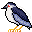 Suzhou, CN: Huqiu Wetland Park 虎丘湿地生态公园

::: column-margin
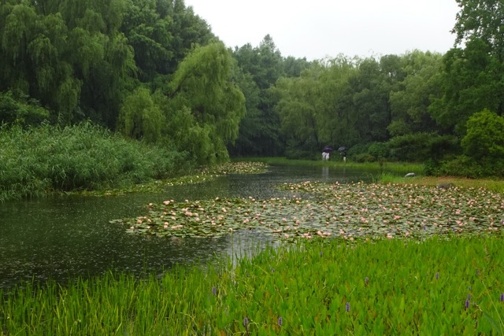{group="landspics"}
:::

-   **Type**: Rural \| Wetlands (fresh water)
-   **First Visited**: June 2025
-   **Last Visited**: Jul 2025
-   **Birds**: Black-crowned Night Heron, Little Grebe, Azure-winged Magpie, Light-vented Bulbul, Little Egret, Red-rumped Swallow, Pheasant-tailed Jacana, Red-billed Starling, Eurasian Moorhen, Chinese Blackbird, Oriental Magpie-Robin
-   **Comments**: My hometown. Very beautiful place, regionally well-known birding hotspot and tourist attraction with reeds, waterlilies and lotus planted all over the ponds and wetlands.
-   **Link**: [ebird](https://ebird.org/region/L17313628)

####  Suzhou, CN: Chongshan Island 冲山岛

::: column-margin
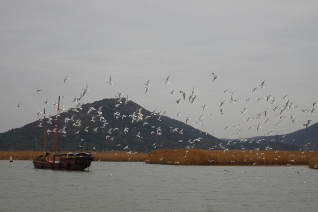{group="landspics"}
:::

-   **Type**: Urban \| Open water (fresh water)
-   **First Visited**: Dec 2025
-   **Last Visited**: Dec 2025
-   **Birds**: Black-headed gull, white wagtail, little grebe, great crested grebe, eurasian coot, spotted dove
-   **Comments**: Part of Taihu Lake. The urban myth is that the Suzhou government use Salmon sashimi to attract black-headed gulls from Wuxi (the city on the other side of Taihu).
-   **Links**: NA

#### 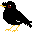 Suzhou, CN: Dushu Lake, East Shore 独墅湖东

::: column-margin
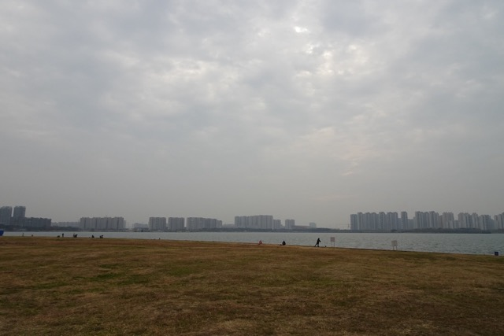{group="landspics"}
:::

-   **Type**: Urban \| Open water (fresh water)
-   **First Visited**: Dec 2025
-   **Last Visited**: Dec 2025
-   **Birds**: Black-crowned Night Heron, Little Grebe, Great Crested Grebe, Light-vented Bulbul, Little Egret, White-cheeked Starling, Eurasian Hoopoe, Chinese Blackbird, Oriental Magpie-Robin, Vega Gull, White Wagtail, Olive-backed Pipit, Richard's Pipit, Eurasian Tree Sparrow, Crested Myna, Long-tailed Shrike
-   **Comments**: Mostly hardened wetlands, migrating birds come to visit at winter. Pipits and wagtails walk happily on the lawn. Whole trail takes ~3.5 hours. 
-   **Links**: [ebird-独墅湖公园](https://ebird.org/region/L33441763) \| [ebird-白鹭园](https://ebird.org/region/L26307800)

#### 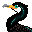 Suzhou, CN: Shuibaxian Eco-cultural Park 水八仙生态文化园

::: column-margin
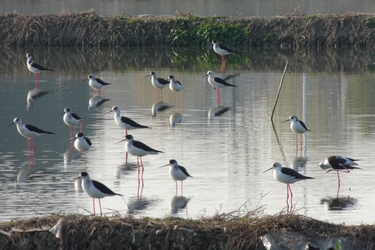{group="landspics"}
:::

-   **Type**: Urban \| Wetlands - Paddy fields (freshwater); Open water (freshwater)
-   **First Visited**: Dec 2025
-   **Last Visited**: Dec 2025
-   **Birds**: Green-winged teal, tufted duck, rock pigeon, eurasian moorhen, eurasian coot, black-winged stilt, northern lapwing, common snipe, marsh sandpiper, spotted redshank, black-headed gull, little grebe, great crested grebe, great cormorant, little egret, great egret, gray heron, common kingfisher, long-tailed shrike, oriental magpie, light-vented bulbul, red-billed starling, crested myna, chinese blackbird, daurian redstart, gray wagtail, white wagtail
-   **Comments**: Paddy fields + part of Chenhu Lake. People raise fish in Chenhu Lake so it attracts a lot of fish-eating bird species. Nice place to watch shorebirds and ducks, has a relatively high entrance fee, though. 'Shuibaxian' means 8 different water-borne vegetables. 
-   **Links**: [ebird-水八仙生态文化园](https://ebird.org/hotspot/L17507817)

#### 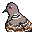 Suzhou, CN: Baitang Arboretum 白塘生态植物园

::: column-margin
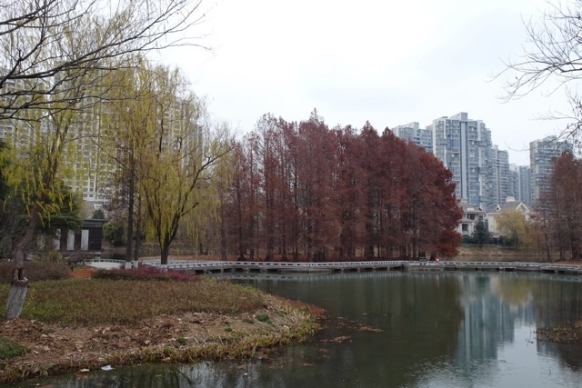{group="landspics"}
:::

-   **Type**: Urban \| Wetlands (freshwater)
-   **First Visited**: Jan 2026
-   **Last Visited**: Jan 2026
-   **Birds**: Eastern spot-billed duck, oriental turtle-dove, eurasian collared-dove, spotted dove, eurasian moorhen, white-breasted waterhen, little grebe, long-tailed shrike, oriental magpie, light-vented bulbul, silver-throated tit, white-cheeked starling, crested myna, chinese blackbird, pale thrush, dusky thrush, verditer flycatcher, eurasian tree sparrow, white wagtail, yellow-billed grosbeak, oriental greenfinch, black-faced bunting
-   **Comments**: City park in SIP, nice place with a bunch of man-made microenvironments, mostly wetlands. Regional migration trap. Most loved bird among local birders is a white-breasted waterhen which resides near the north-western corner of the arboretum. 
-   **Links**: [ebird-白塘生态植物园](https://ebird.org/hotspot/L13265445)

### Northern China

####  Beijing, CN: Olympic Forest Park 奥林匹克森林公园

::: column-margin
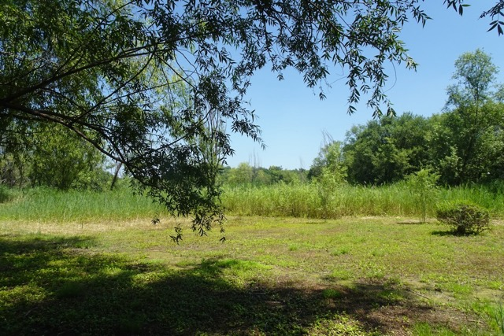{group="landspics"}
:::

-   **Type**: Rural \| Woods; Wetlands (freshwater)
-   **First Visited**: Jul 2025
-   **Last Visited**: Jul 2025
-   **Birds**: Mandarin Duck, Eurasian Moorhen, Eurasian Tree Sparrow, Eurasian Magpie, Azure-winged Magpie, Eurasian Coot, Oriental Reed Warbler, Little Grebe, Grey Headed Woodpecker, Common Kingfisher, Vinous Throated Parrotbill, Grey Capped Greenfinch, Spotted Dove, Rock Pigeon
-   **Comments**: Regional birding hotspot, the 'big pit' of the north park might be one of the most well-known birding hotspot in China with its lush reed marshes. The only problem is that you need to walk 1.5 hours to get to the pit, and there aren't any public transit inside the huge park. DON'T TRY IT IN BEIJING'S SUMMER.
-   **Link**: [ebird](https://ebird.org/region/L13741681)

#### 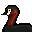 Linyi, CN: Yi River Water Park 沂河/水上公园

::: column-margin
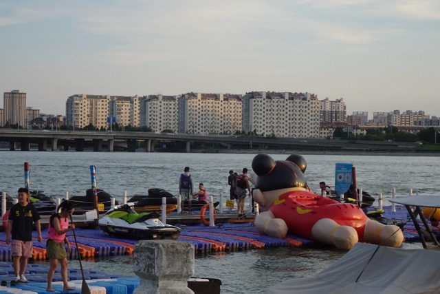{group="landspics"}
:::

-   **Type**: Urban \| Open water (freshwater)
-   **First Visited**: Jul 2025
-   **Last Visited**: Jul 2025
-   **Birds**: Eurasian Tree Sparrow, Eurasian Coot, Little Grebe, Black-crowned Night Heron, Grey Heron, Whiskered Tern
-   **Comments**: Nice place to grab some BBQ and hang out in the evening.
-   **Link**: NA

------------------------------------------------------------------------

## Links & Resources {#links}

### General Recourses

[eBird](https://ebird.org/home) |  [Cornell Lab of Ornithology/Merlin Bird ID](https://merlin.allaboutbirds.org/) |  [BirdWeb](https://birdweb.org/birdweb/) |  [Audubon Society](https://www.audubon.org/) |  [Sibagu The Ornithological Linguist](http://www.sibagu.com/index.html) |  [International Crane Foundation](https://www.savingcranes.org/) | [False Knees - the Bird webcomic by Joshua Barkman](https://www.falseknees.com/) | [Ducks Unlimited](https://www.ducks.org/)

### Local: Greater Lafayette Area/Indiana

[Indiana Audubon Society](https://indianaaudubon.org/) |  [Indiana Birding Trail](https://indianabirdingtrail.com/)

### Local: Baltimore/Maryland

[Maryland Ornithological Society](https://mdbirds.org/) |  [Birder's Guide to Maryland & DC](https://birdersguidemddc.org/) |  [Howard County Bird Club](https://howardbirds.website/) |  [Audubon Maryland-DC](https://md.audubon.org/)

------------------------------------------------------------------------

## End Notes

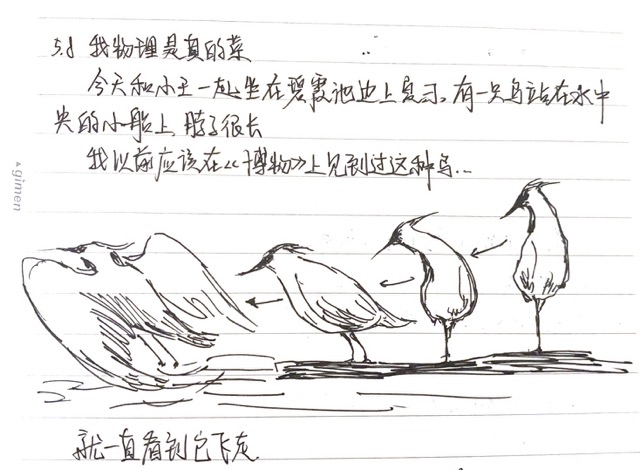

Thanks my friend who introduced me to the world of birding. I will always remember watching night heron with you sitting next to Bixia Pond back in 2019 in the afternoon before taking a Biology exam.

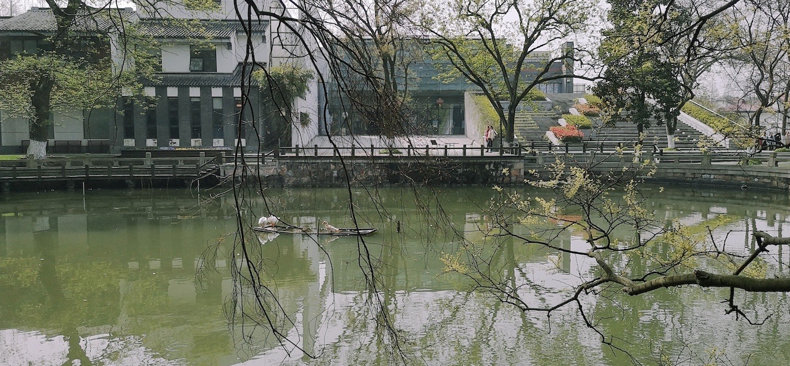