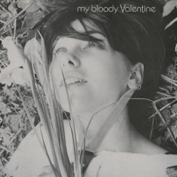
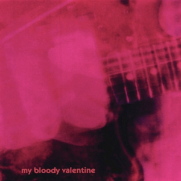
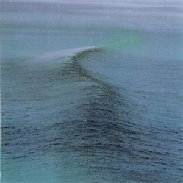
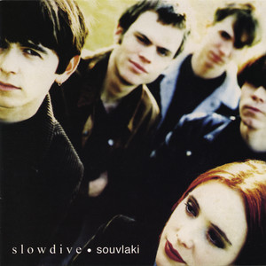

## Introduction

### Why This Project

I'm interested in the 'shoegaze' subgenre of indie rock. This less-known genre, also called 'the scene that celebrates itself', rose from the noise pop scene in the late 80s and early 90s, and has regained popularity recently. An article titled *'The Shoegaze Revival Hit Its Stride in 2023'* [@sherburne_shoegaze_2023] by pitchfork also captures the revival of shoegaze among GenZ populations.

::: column-margin

:::

Shoegaze is characterized by heavy use of overdriven guitar and various effect pedals with the combination of the ethereal vocals; the lyrics are often regarded as blank, poetic, and sometimes difficult to distinguish from the instruments. So here comes this project for the indieheads - I want to analyze those usually overlooked lyrics, especially from the perspective of sentiment.

The bands I want to study are the so-called classic 'big-three' of shoegaze: *my bloody valentine*, *Ride*, and *slowdive*. They were all on the independent record label *Creation* from London, UK, reached their peak in early 90s, disbanded in late 90s due to the fading of the subgenre, and reunited in the 21st century, which make them a perfect fit to study the changes in the lyrics over the years.

### My Questions

1.  What words frequently appear in their lyrics?
2.  Which bands have the longest and shortest lyrics?
3.  Who is the saddest shoegaze band?
4.  Are bands trending towards happiness or sadness over time?

## Project

### Data Acquisition & Wrangling

::: column-margin
  
:::

#### Data Acquisition

Lyrics from all studio albums of the 'big three' bands in the shoegaze genre - *my bloody valentine (mbv)*, *Ride*, and *slowdive* - are retrieved from [Genius.com](https://genius.com/) using a Python package named [lyricsgenius](https://www.johnwmillr.com/scraping-genius-lyrics/) [@miller_johnwmillrlyricsgenius_2024] based on Genius API. Please see the author's instructions for details.

::: callout-note
The downloaded `.json` files were written into a `.csv` file for further processing. Please go to the [source repository](https://github.com/yunyi-ru/quarto-blog) for more details.
:::

```{r load data, message = FALSE, warning = FALSE}
# load packages
library('stringi')
library('tidyverse')
library('lubridate')
library('knitr')

# reference
knitr::write_bib("rmarkdown", file = "my-refs.bib")

# import data
lyrics <- read.csv("data/lyrics_data.csv")
kable(head(lyrics, n = 1))
```

#### Data Dictionary

| Field Name     | Data Type | Description                               |
|----------------|-----------|-------------------------------------------|
| `Track.Number` | Integer   | The track number of the song in the album |
| `Song.Title`   | String    | The title of the song                     |
| `Artist`       | String    | The artist performing the song            |
| `Release.Date` | String    | The date the song was released            |
| `Lyrics`       | String    | The lyrics of the song                    |
| `Album.Name`   | String    | The name of the album the song belongs to |

#### Data Wrangling

The lyrics directly retrieved from Genius.com usually have some problems -

::: callout-warning
1.  '16 ContributorsBallad of Sister Sue Lyrics' at the beginning and '6Embed' at the end are not part of the lyrics.
2.  '’' - some problem with Unicode encoding/decoding.
3.  'See Slowdive LiveGet tickets as low as \$55' - ads is also not part of the lyrics.
:::

So, it requires some data cleaning.

```{r data cleaning, message = FALSE}
# clean text
lyrics_clean <- lyrics %>%
  mutate(Lyrics = stri_enc_toutf8(Lyrics)) %>%
  mutate(Lyrics = str_replace_all(Lyrics, 'â\u0080\u0099', "'")) %>%
  mutate(
    Lyrics = Lyrics %>%
      str_remove(".*Lyrics") %>%
      str_remove("See.*tickets as low as \\$\\d+") %>%
      str_remove('You might also like') %>%
      str_remove('\\d*\\s*Embed$') %>%
      str_trim()
  ) %>%
  rename(Album = Album.Name) %>%
  filter(!str_detect(Lyrics, "^\\s*$")) # filter out instrumental pieces

# add some factors for further processing
lyrics_clean <- lyrics_clean %>%
  mutate(lyric.length = nchar(Lyrics),
         Release.Date = dmy(Release.Date),
         Release.Year = year(Release.Date))

print(lyrics_clean[1,'Lyrics'])

# this is for ride-only analysis
lyrics_ride <- lyrics_clean %>%
  filter(Artist == 'Ride')

# this keeps the dataset working for the original analysis
lyrics_clean <- lyrics_clean %>%
  filter(!str_detect(Album, "\\[EP\\]")) %>%
  mutate(Album = factor(Album, 
                        levels = c("Isn’t Anything", "loveless", "m b v", 
                                   "Nowhere", "Going Blank Again", "Carnival of Light", "Tarantula", "Weather Diaries", "This Is Not a Safe Place", "Interplay", 
                                   "Just for a Day", "Souvlaki", "Pygmalion", "Slowdive", "​​​everything is alive")))
```

### Data Analysis

#### What words frequently appear in their lyrics?

```{r q1, warning = FALSE, message = FALSE}
library('tidytext')

# tokenize by word
token <- lyrics_clean %>%
  unnest_tokens(output = Word,
                input = Lyrics,
                token = 'words')

# stopwords dropped
token_clean <- token %>%
  anti_join(stop_words, by = c("Word" = "word"))

token_count_cloud <- token_clean %>%
  group_by(Artist) %>%
  count(Word, name = 'Word_count', sort = TRUE)

token_count_head <- token_count_cloud %>%
  group_by(Artist) %>%
  slice(1:30) %>%
  mutate(Word = fct_reorder(Word, Word_count, .desc = FALSE))

# make a word cloud
library(ggplot2)
theme_set(theme_bw())
library(ggwordcloud)
palette <- c(
  "my bloody valentine" = "#d83c7a",
  "Ride" = "#4b8ab8",
  "Slowdive" = "#ae8f32",
  "when you sleep" = "#f576a8",
  "Vapour Trail" = "#56a8e3",
  "When the Sun Hits" = "#d1b971"
  )

ggplot(token_count_head, aes(
  label = Word,
  size = Word_count,
  color = Artist
)) +
  geom_text_wordcloud(word.ratio = 0.2, # adjust for overall word size
                      max_size = 30) +
  facet_wrap(~ Artist) +
  scale_color_manual(values = palette) +
  labs(
    title = 'Most Frequently Used Words in Lyrics',
    caption = 'Word size based on frequency. Only the top 30 results are shown here.'
  )
```

The result is kind of amusing. Ride and mbv rely their vocals heavily on **harmonies** and **hummings** - and it's reflected honestly here, while slowdive has the most **'meaningful'** lyrics among the three. 'Love' is the ultimate meaning of rock and roll, and it indeed appears in high frequency in all of their lyrics.

#### Which bands have the longest and shortest lyrics?

```{r q2, warning = FALSE, message = FALSE}
# plotting
ggplot(lyrics_clean, aes(x = Album, y = lyric.length, fill = Artist)) + 
  geom_boxplot(color = 'black') +
  scale_fill_manual(values = palette) +
  labs(
    title = 'Which bands have the Longest/Shortest Lyrics?',
    caption = 'Boxplot showing the range and median of lyric lengths for each Album.', 
    color = 'Before Reunion?', 
    y = 'Lyric Length (character)'
  ) +
  theme(axis.text.x = element_text(angle = 45, hjust = 1))
```

Among the three bands, Mbv always has the shortest lyrics overall while Ride has the longest. An interesting trend is that while Ride and slowdive have similar lyric length back in the 90s, after reunion, Ride tends to have longer lyrics - and the length increases for each album.

#### Who is the saddest shoegaze band?

I used `afinn` from package `tidytext` for sentiment analysis based on this paper[@koto_comparative_2015].

```{r q3, warning = FALSE, message = FALSE}
# data processing: sentiment 'afinn'
token_count <- token_clean %>%
  group_by(Artist, Album, Release.Year) %>%
  count(Word, name = 'Word_count', sort = TRUE) %>%
  ungroup()

token_afinn <- token_count %>%
  inner_join(get_sentiments('afinn'), by = c("Word" = "word"))

afinn_score_by_artist <- token_afinn %>%
  group_by(Artist) %>%
  summarize(avg = round(mean(value), 2)) %>%
  ungroup()

kable(afinn_score_by_artist)
```

Among the three bands, mbv has the lowest sentiment score, which means it is the saddest shoegaze band (if we only look at the lyrics). All three bands got sentiment scores less than or equal to zero, with slowdive holding the highest score (0.00).

##### What about their greatest hits?

Using data from [last.fm](last.fm), we find out that the greatest hits of the three bands are:

-   *when you sleep* - my bloody valentine (32171 weekly listeners),
-   *Vapour Trail* - Ride (1943 weekly listeners), and
-   *When the Sun Hits* - Slowdive (53055 weekly listeners).

I'm interested that whether those songs have a happier or sadder vibe compared to their other songs -

```{r q3.2, warning = FALSE, message = FALSE}
# by song
token_count_bysong <- token_clean %>%
  group_by(Artist, Song.Title) %>%
  count(Word, name = 'Word_count', sort = TRUE) %>%
  ungroup()

# give afinn score
token_afinn_bysong <- token_count_bysong %>%
  inner_join(get_sentiments('afinn'), by = c("Word" = "word"))

# clean data set, drop songs with only 1/2 rows
token_afinn_bysong <- token_afinn_bysong %>%
  group_by(Song.Title) %>%
  filter(n() > 2) %>%
  ungroup()

# calculate average scores
afinn_score_all <- token_afinn_bysong %>%
  group_by(Song.Title, Artist) %>%
  summarize(avg_song = mean(value))

# look at the greatest hits
afinn_score_gh <- afinn_score_all %>%
  filter(Song.Title == 'Vapour Trail' | Song.Title == 'When the Sun Hits' | Song.Title == 'when you sleep')

# combine datasets for plotting
afinn_score_gh <- inner_join(afinn_score_gh, afinn_score_by_artist, by = c("Artist" = "Artist"))

# plot
ggplot(afinn_score_gh, aes(x = Artist)) +
  geom_point(shape = 16, size = 3, aes(y = afinn_score_gh$avg, color = Artist)) +
  geom_point(shape = 17, size = 3, aes(y = afinn_score_gh$avg_song, color = 
Song.Title)) +
  scale_color_manual(values = palette) +
  geom_hline(yintercept = 0, linetype = 'dashed', color = 'black') +
  labs(
    title = 'Who is the Saddest Shoegaze Band?',
    caption = 'Average sentiment score calculated based on afinn scores.\n<0: sad/negative, >0: happy/positive.', 
    y = 'Sentiment Score', 
    x = 'Time', 
    color = 'Artist average/\ngreatest hits'
  )
```

Mbv has the lowest overall sentiment score. All those songs have a slightly higher sentiment score than their artist's average scores. People seem to prefer happy songs!

##### So what are their happiest/saddest songs?

```{r q3.3}
extreme_song <- afinn_score_all %>%
  group_by(Artist) %>%
  filter(avg_song == max(avg_song) | avg_song == min(avg_song)) %>%
  ungroup()

sorted_tibble <- extreme_song %>%
  group_by(Artist) %>%
  arrange(Artist, avg_song) %>%
  ungroup()

kable(sorted_tibble)
```

With the table above, we find that Ride's saddest songs are *'I Came to See the Wreck'* and *'Only Now'*, and happiest songs is *'The Dawn Patrol'*; Slowdive's saddest song is *'The Sadman'*, and happiest songs is *'Everyone Knows'*; mbv's saddest song is *'if i am'*, and happiest song is *'only shallow'*. **The Sadman is really sad**.

#### Are bands trending towards happiness or sadness over time?

```{r q4, warning = FALSE, message = FALSE}
afinn_score <- token_afinn %>%
  group_by(Artist, Album, Release.Year) %>%
  summarize(avg = mean(value))

library(ggrepel)
ggplot(afinn_score,
       aes(x = Release.Year, y = avg, color = Artist, label = Album)) +
  geom_point() +
  geom_line() +
  geom_text_repel(size = 3) +
  geom_hline(yintercept = 0, linetype = 'dashed', color = 'black') +
  scale_color_manual(values = palette) +
  scale_y_continuous(limits = c(-1,1)) +
  labs(
    title = 'Sentiment Trend of Lyrics Over Time',
    caption = 'Average sentiment score calculated based on afinn scores.\n<0: sad/negative, >0: happy/positive.',
    color = 'Artist',
    y = 'Sentiment Score', 
    x = 'Time'
  )
```

When examining the trend over time, it is noteworthy that at the beginning of their careers, the bands all had very sad lyrics; in the middle of their careers, their lyrics became more positive. It is also interesting to observe that the latest albums of mbv, Ride, and Slowdive are all among the saddest of their entire careers.

## Bonus: Here Comes the RIDE Fan!

RIDE blew my mind when I attended their Nowhere concert with the Charlatans back in Jan 2024 in the amazing venue Union Transfer, Philadelphia. Since then I've become a huge fan... So I couldn't help but did more data analysis on them (!).

**Disclaimer**: I'm by no means overlooking the members who do not write the lyrics. I love you Steve. It's just because I can only do text analysis at this time.

### My Questions

1.  Who writes the lyrics in each album?

2.  What’s the most frequently used words for each lyricist before/after reunion?

3.  Top 5 Words for Each Album

4.  Who is the Saddest Lyricist?

5.  Are they trending towards happiness or sadness over time?

### Data Wrangling

Information about lyric writers were from interviews and record sleeves.

```{r ride color, echo = FALSE, warning = FALSE, message = FALSE}
# a ride palette!
ride_palette <- c(
  '#d2e2e2',
  '#93d6de',
  '#a688b9',
  '#b08c8f',
  '#74badd',
  '#c3c577',
  '#9cc789', 
  '#f7c75d',
  '#f3f06a',
  '#ee6352',
  '#e87d87',
  '#6c7ec4',
  '#7e738b',
  '#7d7d7d',
  '#45b1b8',
  '#e9de9d'
)
```

```{r ride data processing, warning = FALSE, message = FALSE}
# assign lyricist
andy_bell_songs <- c("Drive Blind", "Close My Eyes", "Like A Daydream", "Silver", "Dreams Burn Down", "Here And Now", "Seagull", "Kaleidoscope", "In a Different Place", "Polar Bear", "Paralysed", "Vapour Trail", "Sennen", "Beneath", "Today", "Not Fazed", "Chrome Waves", "Time of Her Time", "Cool Your Boots", "Making Judy Smile", "Going Blank Again", "Howard Hughes", "Birdman", "Crown of Creation", "Endless Road", "Magical Spring", "I Don’t Know Where It Comes From", "Sunshine/Nowhere To Run", "Dead Man", "Walk on Water", "Mary Anne", "Castle On The Hill", "Gonna Be Alright", "The Dawn Patrol", "Ride The Wind", "Burnin’", "Starlight Motel", "Charm Assault", "Home Is A Feeling", "Weather Diaries", "Lateral Alice", "Cali", "Impermanence","Cold Water People", "Catch You Dreaming", "Future Love", "Repetition", "Kill Switch", "Clouds of Saint Marie", "Fifteen Minutes", "Jump Jet", "Dial Up", "End Game", "In This Room", "Peace Sign", "Last Frontier", "Light in a Quiet Room", "Stay Free", "Last Night I Went Somewhere to Dream", "Midnight Rider", "Portland Rocks", "Yesterday Is Just a Song")

mark_gardener_songs <- c("Chelsea Girl", "All I Can See", "Furthest Sense", "Perfect Time", "Taste", "Decay", "Unfamiliar", "Leave Them All Behind", "Twisterella", "Mouse Trap", "Time Machine", "OX4", "Stampede", "Moonlight Medicine", "1000 Miles", "From Time To Time", "Only Now", "Deep Inside My Pocket", "Lannoy Point", "White Sands", "Pulsar", "Keep It Surreal", "Shadows Behind the Sun", "Monaco", "I Came to See the Wreck", "Sunrise Chaser", "Essaouira")

loz_colbert_songs <- c("Nowhere", "Natural Grace", "Rocket Silver Symphony", "R.I.D.E.")

collab_songs <- c("All I Want", "Eternal Recurrence")

cover_songs <- c("How Does It Feel to Feel?")

lyrics_ride <- lyrics_ride %>%
  mutate(lyricist = case_when(
         Song.Title %in% andy_bell_songs ~ "Andy.Bell",
         Song.Title %in% mark_gardener_songs ~ "Mark.Gardener",
         Song.Title %in% loz_colbert_songs ~ "Loz.Colbert",
         Song.Title %in% collab_songs ~ "collaboration",
         Song.Title %in% cover_songs ~ "cover",
         TRUE ~ NA_character_
         ),
         Album = fct_reorder(Album, Release.Date),
         is90 = Release.Year < 2000)
```

### Data Analysis

```{r ride tokenize, warning = FALSE, message = FALSE}
# tokenize
# tokenize by word
ride_token <- lyrics_ride %>%
  unnest_tokens(output = Word,
                input = Lyrics,
                token = 'words')

# unique by song
ride_token_unique <- ride_token %>%
  group_by(Song.Title) %>%
  distinct(Song.Title, Word, .keep_all = TRUE) %>%
  ungroup()

# stopwords dropped
ride_token_clean <- ride_token_unique %>%
  anti_join(stop_words, by = c("Word" = "word"))
```

#### Who writes the lyrics in each album?

```{r ride who writes what, warning = FALSE, message = FALSE}
# who writes what
ggplot(lyrics_ride, aes(x = Album, fill = lyricist)) +
geom_bar() +
scale_fill_manual(values = ride_palette) +
scale_y_continuous(breaks = 1:12, minor_breaks = 1:12) +
theme(axis.text.x = element_text(angle = 45, hjust = 1))+
  labs(title = 'Who writes the lyrics in each album?',
    fill = 'Lyricist',
    y = 'Count', 
    x = 'Album'
  )
```

Andy Bell did a lot, especially for Nowhere, Tarantula, and This is Not a Safe Place.

#### What's the most frequently used words for each lyricist before/after reunion?

```{r ride most frequent words, warning = FALSE, message = FALSE}
# count - lyricist, is90
ride_token_count <- ride_token_clean %>%
  group_by(lyricist, is90) %>%
  count(Word, name = 'Word_count', sort = TRUE) %>% 
  ungroup()

# find top 15
ride_token_count_head_bylyricist <- ride_token_count %>%
  group_by(lyricist, is90) %>%
  filter(lyricist == 'Andy.Bell' | lyricist == 'Mark.Gardener') %>%
  slice(1:15) %>%
  mutate(Word = fct_reorder(Word, Word_count, .desc = FALSE)) %>%
  ungroup()

# most frequent words
ggplot(ride_token_count_head_bylyricist, aes(x = Word_count, y = Word, fill = is90)) +
  geom_col() +
  facet_wrap( ~ lyricist) +
  scale_fill_manual(values = ride_palette, name = 'Status', labels = c('After Reunion', 'Before Reunion')) +
  scale_x_continuous(breaks = c(0, 5, 10, 15, 20, 25), minor_breaks = 1:25) +
  labs(title = "What's the most frequently used words for each lyricist\nbefore/after reunion?",
    fill = 'Before Reunion',
    caption = 'Only top 15 frequently used words were shown.',
    y = 'Word', 
    x = 'Count'
  )
```

It's surprising that 'time' was used a lot. I'm interested that whether all bands like this word or it's just RIDE. Maybe it would be my next project in the future.

#### Top 5 Words for Each Album

```{r ride the word for each album, warning = FALSE, message = FALSE}
# The Word for each album?
ride_token_count_album <- ride_token_clean %>%
  group_by(Album) %>%
  count(Word, name = 'Word_count', sort = TRUE)

# find top 5
ride_token_count_album_head <- ride_token_count_album %>%
  group_by(Album) %>%
  slice(1:5) %>%
  filter(!Word_count == 1) %>%
  mutate(Word = fct_reorder(Word, Word_count, .desc = FALSE)) %>%
  ungroup()

# plotting
ggplot(ride_token_count_album_head, aes(x = Album, y = Word, label = Word)) +
  geom_text(size = 3, aes(color = Word_count)) +
  scale_color_continuous(high = '#a688b9', low = '#ccd8e0') +
  coord_fixed(ratio = 0.3) + 
  theme(axis.text.x = element_text(angle = 45, hjust = 1)) +
  labs(title = 'Top 5 Words for Each Album',
    color = 'Count',
    y = 'Word', 
    x = 'Album'
  )
```

Some themes are always there - time, day, life, feel...

#### Who is the Saddest Lyricist?

```{r ride who is more depressed, warning = FALSE, message = FALSE}
# who is more depressed
ride_token_count_aa <- ride_token_clean %>%
  group_by(lyricist, Album, Release.Date) %>%
  count(Word, name = 'Word_count', sort = TRUE) %>%
  ungroup()

# apply sentiment value
ride_token_afinn_aa <- ride_token_count_aa %>%
  inner_join(get_sentiments('afinn'), by = c("Word" = "word")) %>% 
  filter(lyricist == 'Mark.Gardener' | lyricist == 'Andy.Bell' | lyricist == 'Loz.Colbert')

# calculate overall score
ride_afinn_score_by_lyricist <- ride_token_afinn_aa %>%
  group_by(lyricist) %>%
  summarize(weighted_avg = round(sum(value * Word_count) / sum(Word_count),2)) %>%
  ungroup()

# plotting
ggplot(ride_afinn_score_by_lyricist, aes(x = lyricist, y = weighted_avg, fill = lyricist, label = weighted_avg)) +
  geom_col() +
  geom_text() +
  scale_y_continuous(breaks = c(-1, 0, 1), limits = c(-1.5,1.5)) +
  scale_fill_manual(values = ride_palette) +
  geom_hline(yintercept = 0, linetype = 'dashed', color = 'black') +
  labs(title = 'Who is the Saddest Lyricist?',
    y = 'Sentiment Score', 
    caption = 'Average sentiment score calculated based on afinn scores.\n<0: sad/negative, >0: happy/positive.',
    x = 'Lyricist',
    fill = 'Lyricist'
  )
```

Mark Gardener seems really sad.

#### Are they trending towards happiness or sadness over time?

```{r ride who is getting more depressed, warning = FALSE, message = FALSE}
# Is anyone getting more depressed over time?
# assign affin score for each person for each album
ride_afinn_score_by_lyricist_album <- ride_token_afinn_aa %>%
  group_by(lyricist, Album, Release.Date) %>%
  summarize(weighted_avg = round(sum(value * Word_count) / sum(Word_count),2))

# geom_line() must work with numeric factor
ride_afinn_score_by_lyricist_album$Album_num <- as.numeric(ride_afinn_score_by_lyricist_album$Album)

# plotting
ggplot(ride_afinn_score_by_lyricist_album, 
       aes(x = Album_num, y = weighted_avg, color = lyricist, shape = lyricist, label = Album)) +
  geom_point(size = 3) + 
  geom_line() +
  scale_color_manual(values = ride_palette) +
  scale_x_continuous(
    breaks = ride_afinn_score_by_lyricist_album$Album_num,
    labels = ride_afinn_score_by_lyricist_album$Album
  ) +
  scale_y_continuous(limits = c(-2,2)) +
  geom_hline(yintercept = 0, linetype = 'dashed', color = 'black') +
  theme(axis.text.x = element_text(angle = 45, hjust = 1)) +
  labs(
    title = 'Sentiment Trend of Lyrics Over Time',
    caption = 'Average sentiment score calculated based on afinn scores.\n<0: sad/negative, >0: happy/positive.',
    color = 'lyricist',
    y = 'Sentiment Score', 
    x = 'Album'
  )
```

Are people getting sadder when they get old?

------------------------------------------------------------------------

*This is a class project of Johns Hopkins University [Biostatistics 140.777 Statistical Programming Paradigms](https://www.stephaniehicks.com/jhustatprogramming2024/) course*.
